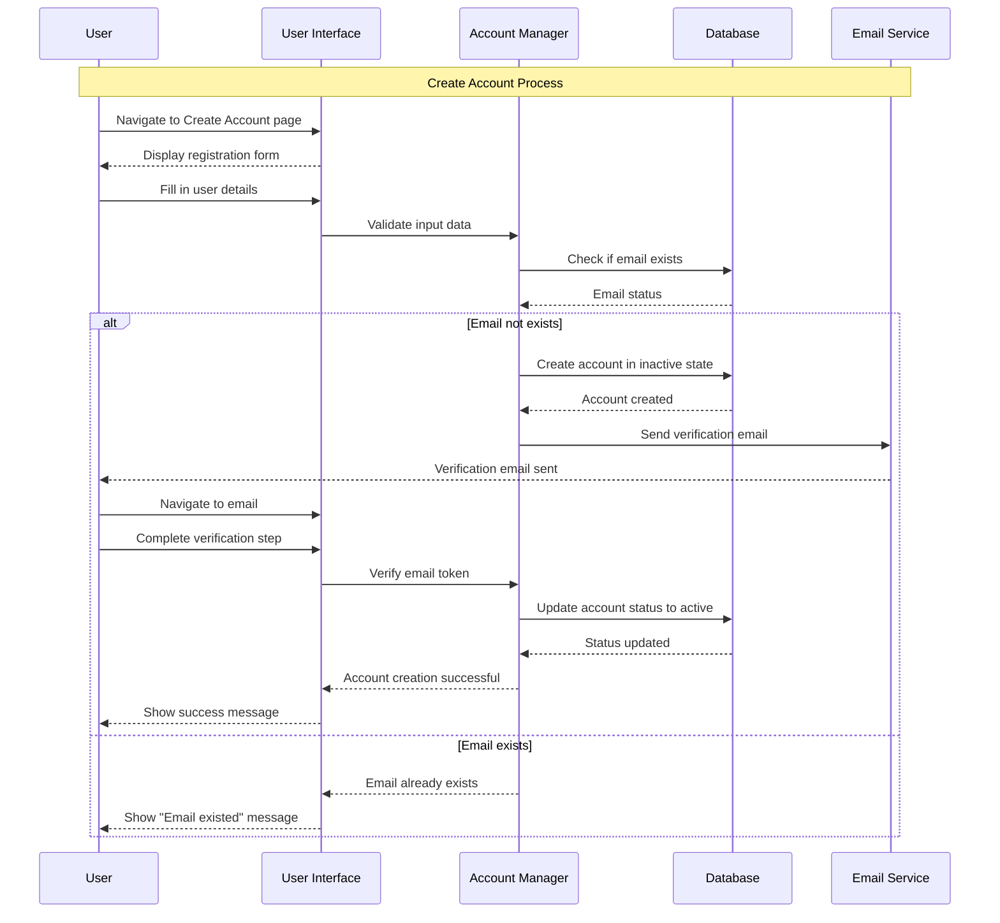
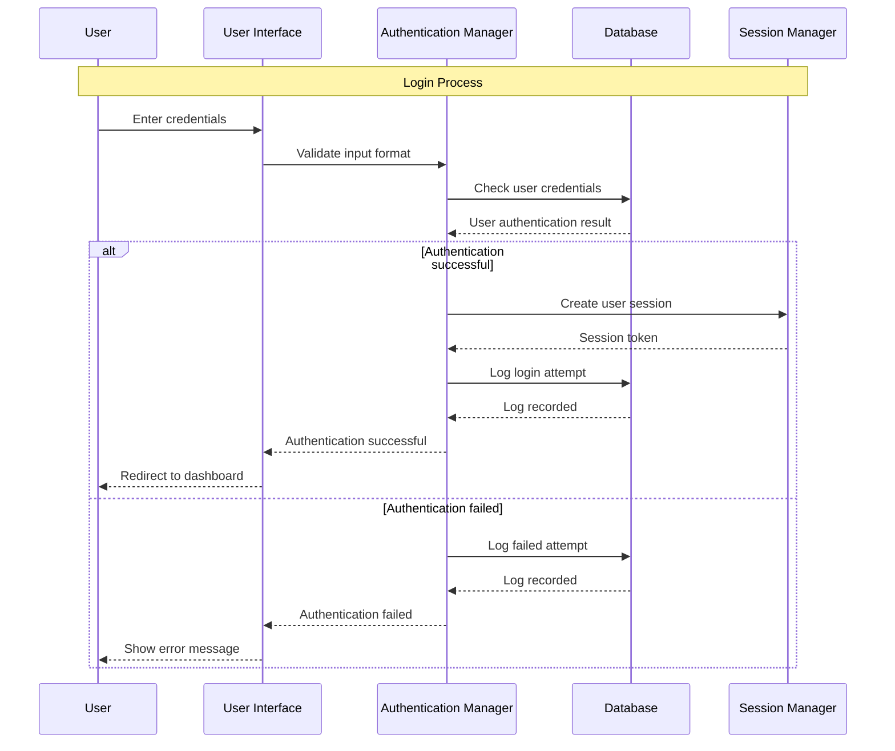
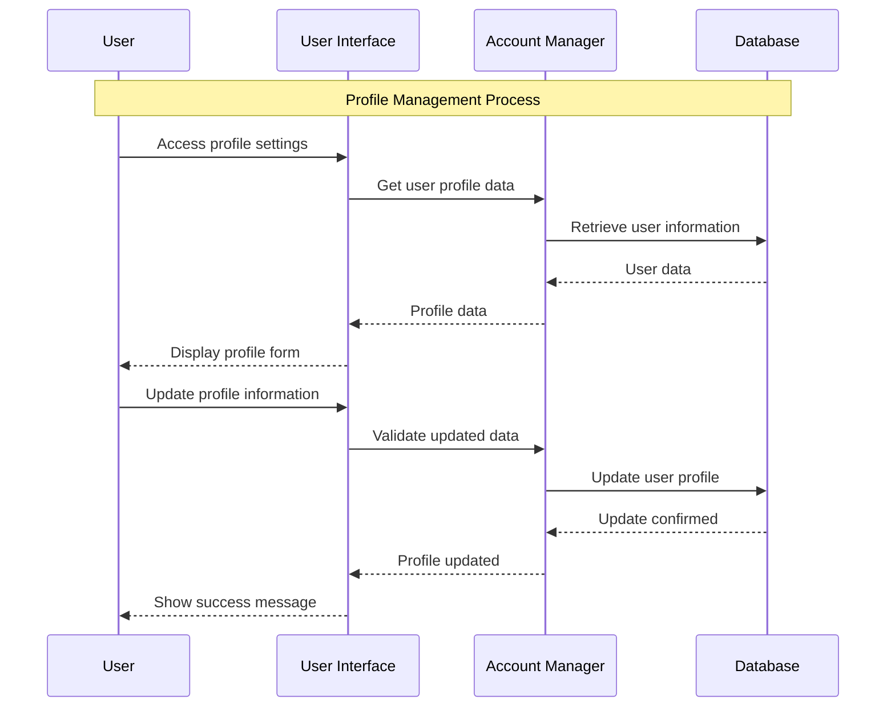
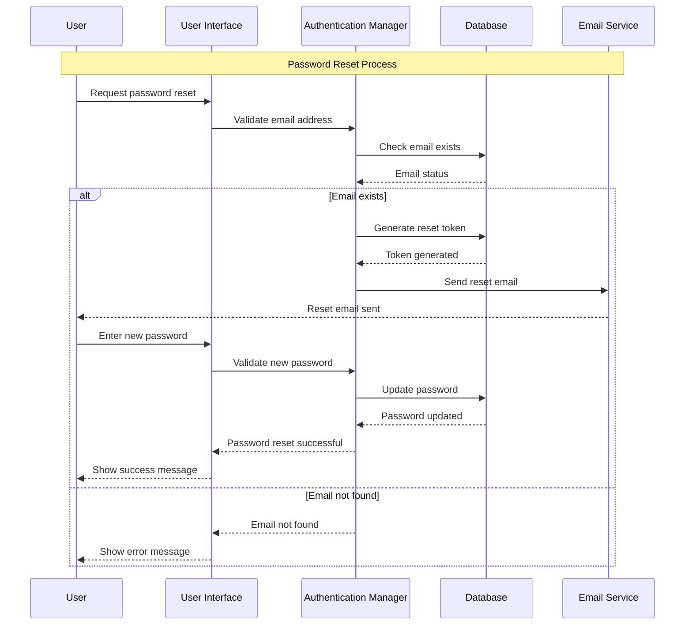
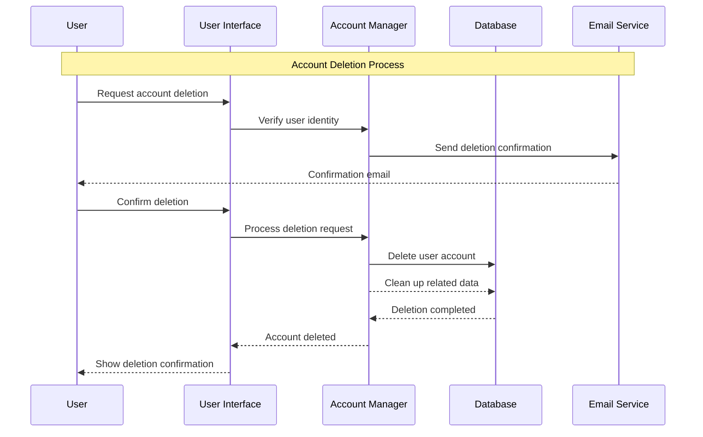

# Account Management Module - Sequence Diagrams

## 1.1 Create Account Sequence Diagram

## 1.2 Login Sequence Diagram

## 1.3 Manage Profile Sequence Diagram

## 1.4 Password Reset Sequence Diagram

## 1.5 Account Deletion Sequence Diagram

