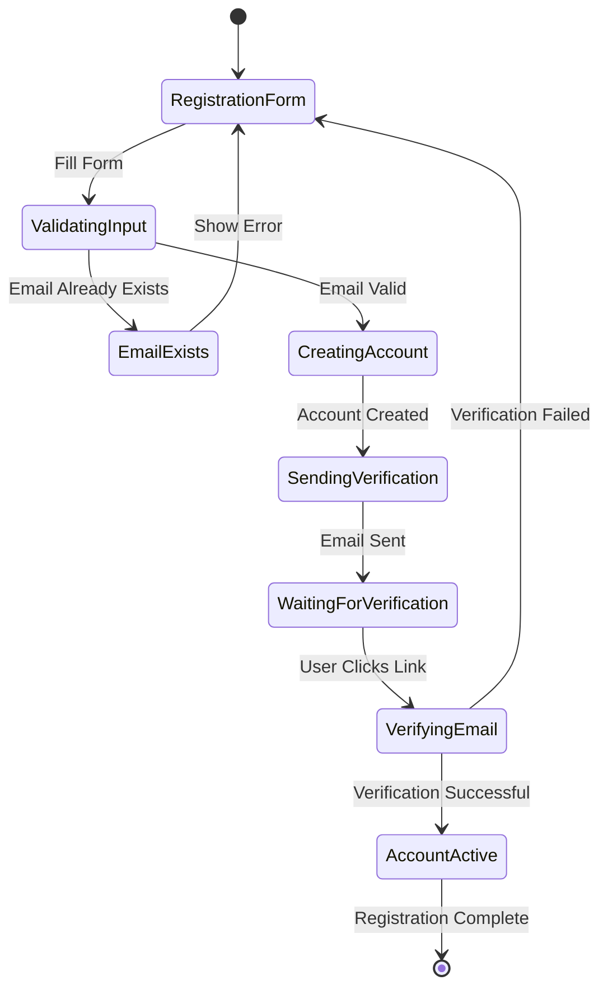
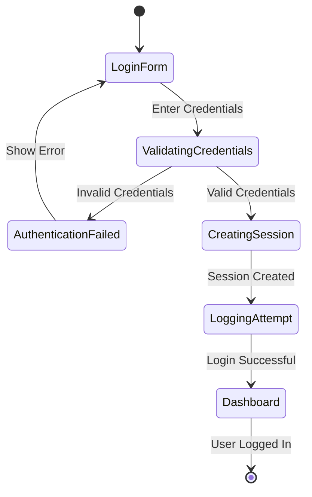
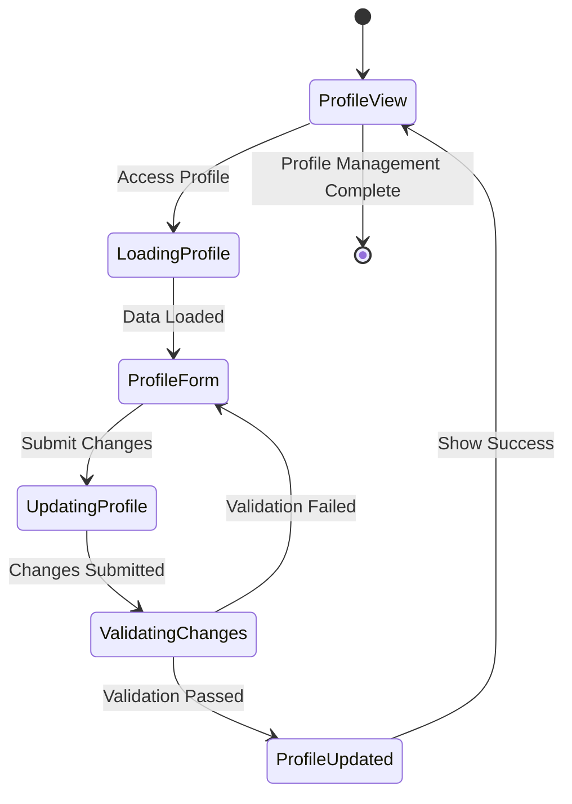
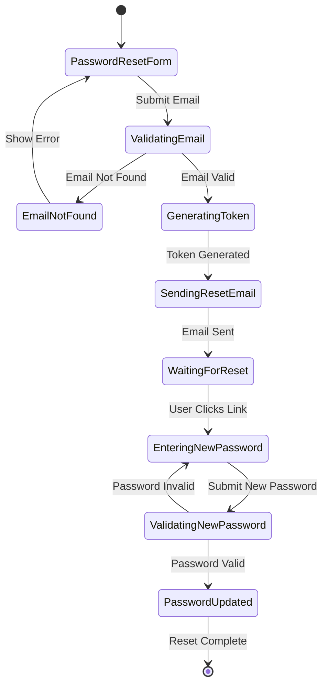
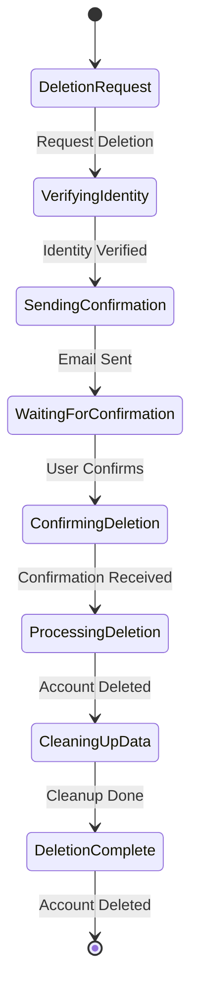

# Account Management Module - State Diagrams

## 1.1 Create Account State Diagram

## 1.2 Login State Diagram

## 1.3 Manage Profile State Diagram

## 1.4 Password Reset State Diagram

## 1.5 Account Deletion State Diagram

