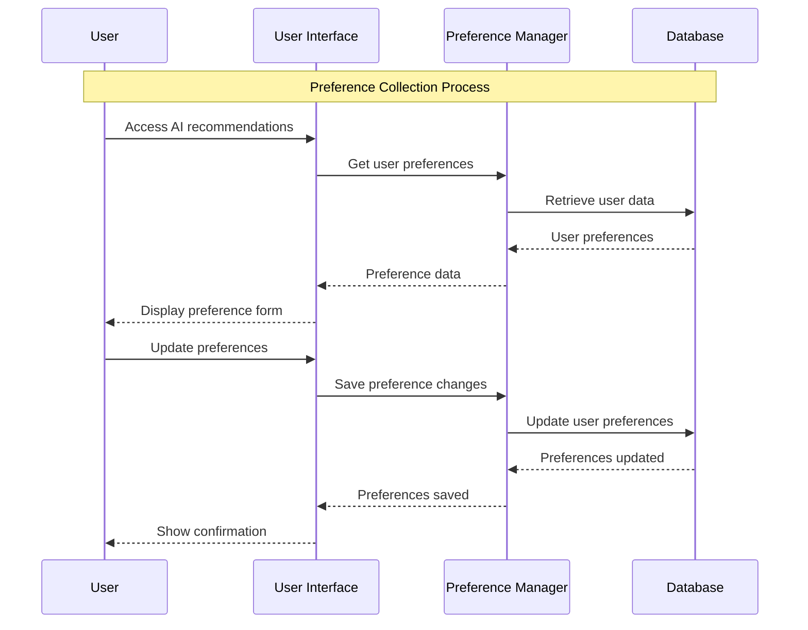
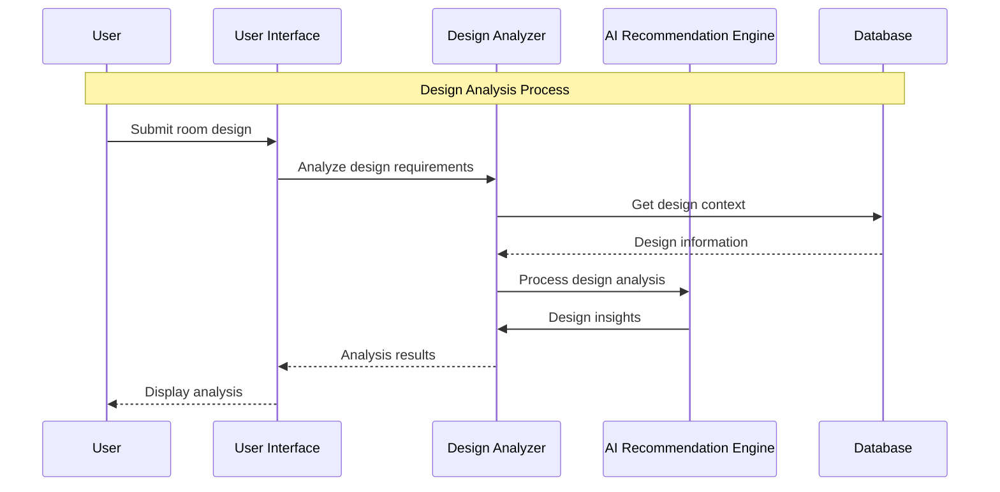
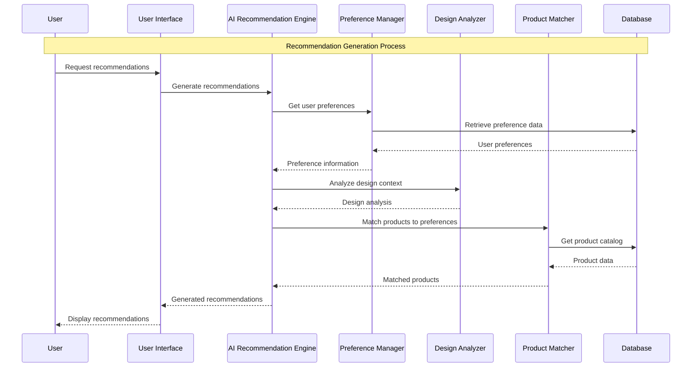
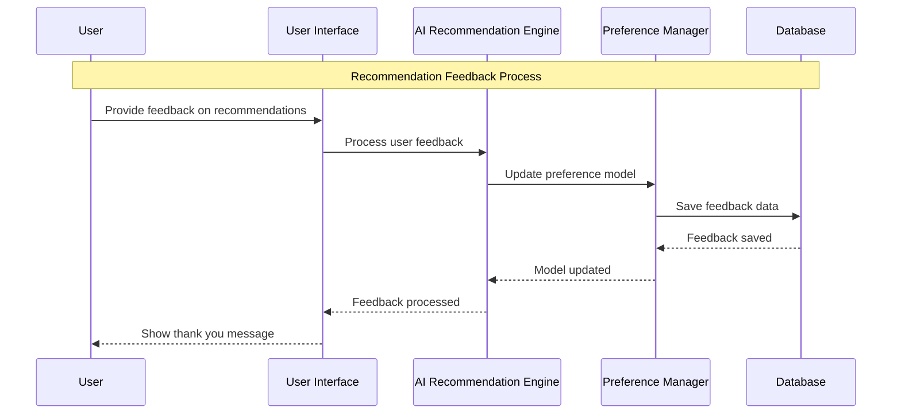

# AI Recommendation Module - Sequence Diagrams

## 3.1 Preference Collection Sequence Diagram

## 3.2 Design Analysis Sequence Diagram

## 3.3 Recommendation Generation Sequence Diagram

## 3.4 Recommendation Feedback Sequence Diagram

