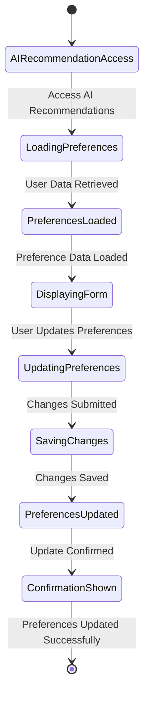
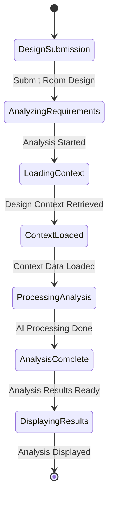
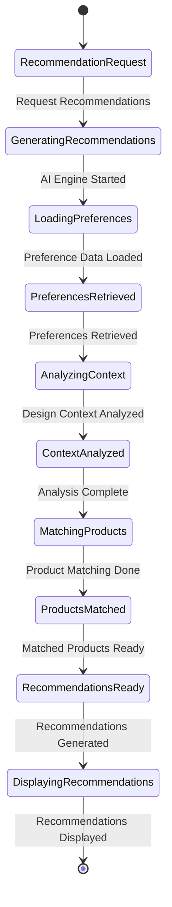
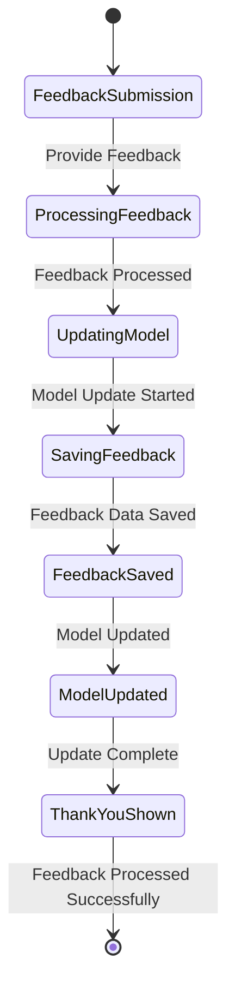

# AI Recommendation Module - State Diagrams

## 3.1 Preference Collection State Diagram

## 3.2 Design Analysis State Diagram

## 3.3 Recommendation Generation State Diagram

## 3.4 Recommendation Feedback State Diagram

