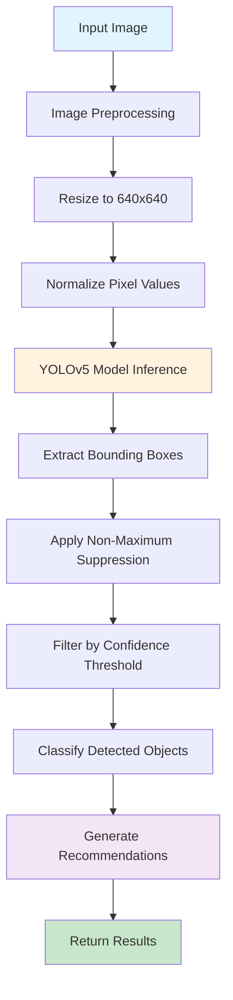
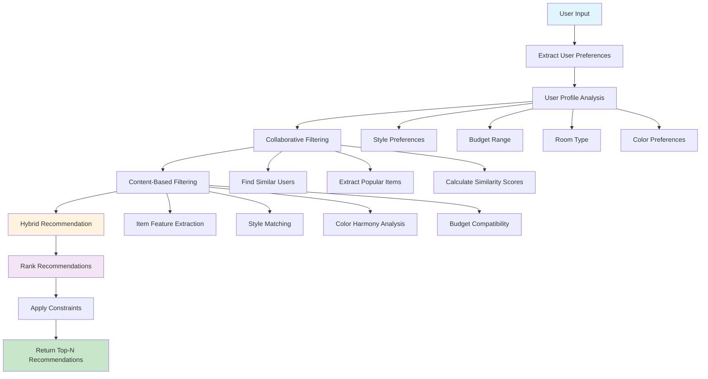
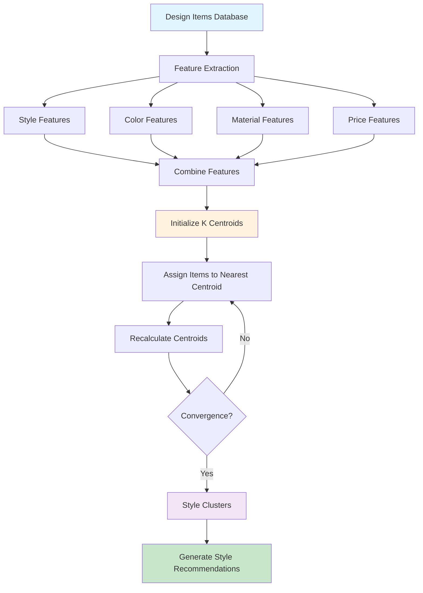
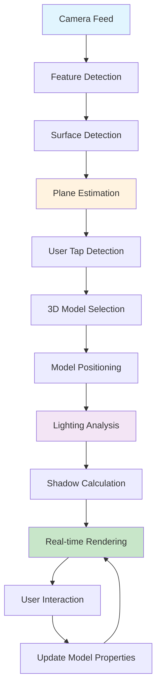

# Algorithm Design for Interior Design Recommendation System

## Overview

This document outlines the core algorithms implemented in the Interior Design Recommendation System, focusing on Artificial Intelligence (AI) and Augmented Reality (AR) technologies that power the application's intelligent features.

## 1. Image Recognition Algorithm (YOLOv5)

### Algorithm Description
YOLOv5 (You Only Look Once version 5) is implemented for real-time object detection in interior spaces. This algorithm enables the system to identify furniture, decorative items, and architectural elements from user-uploaded photos or real-time camera feeds.

### Flowchart


### Pseudocode
```python
Algorithm YOLOv5_Object_Detection
Input: image (RGB format)
Output: detected_objects, recommendations

1. PREPROCESS_IMAGE(image)
   - resize_image(image, 640, 640)
   - normalize_pixels(image, 0-255 to 0-1)
   - convert_to_tensor(image)

2. MODEL_INFERENCE(preprocessed_image)
   - load_yolov5_model()
   - predictions = model.forward(preprocessed_image)
   - return predictions

3. POST_PROCESS(predictions)
   - bounding_boxes = extract_boxes(predictions)
   - confidence_scores = extract_scores(predictions)
   - class_ids = extract_classes(predictions)
   
4. NON_MAXIMUM_SUPPRESSION(bounding_boxes, confidence_scores)
   - sort_by_confidence(confidence_scores)
   - remove_overlapping_boxes(bounding_boxes, iou_threshold=0.5)
   - return filtered_boxes

5. CLASSIFY_OBJECTS(filtered_boxes, class_ids)
   - furniture_classes = ['chair', 'table', 'sofa', 'bed', 'cabinet']
   - decorative_classes = ['lamp', 'vase', 'painting', 'mirror']
   - architectural_classes = ['window', 'door', 'wall', 'ceiling']
   
6. GENERATE_RECOMMENDATIONS(detected_objects)
   - analyze_room_layout(detected_objects)
   - identify_missing_elements()
   - suggest_complementary_items()
   - return recommendations

7. RETURN_RESULTS(detected_objects, recommendations)
```

### Detailed Explanation

YOLOv5 operates through a single neural network that processes the entire image at once, making it extremely fast for real-time applications. The algorithm works in three main stages:

1. **Feature Extraction**: The backbone network (CSPDarknet53) extracts hierarchical features from the input image at different scales.

2. **Multi-scale Prediction**: The neck network (PANet) combines features from different scales to predict objects at various sizes.

3. **Detection Head**: Three detection heads output bounding boxes, confidence scores, and class predictions for different object sizes.

The system uses transfer learning, fine-tuning a pre-trained YOLOv5 model on a custom dataset of interior design elements. This enables accurate detection of furniture, decorative items, and architectural features with real-time performance suitable for mobile applications.

## 2. Recommendation Engine Algorithm (Collaborative Filtering + Content-Based)

### Algorithm Description
The recommendation engine combines collaborative filtering and content-based filtering to provide personalized interior design suggestions based on user preferences, similar users' choices, and item characteristics.

### Flowchart


### Pseudocode
```python
Algorithm Hybrid_Recommendation_Engine
Input: user_id, room_type, budget, style_preferences
Output: top_recommendations

1. EXTRACT_USER_PROFILE(user_id)
   - user_history = get_user_purchase_history(user_id)
   - user_preferences = get_user_preferences(user_id)
   - user_ratings = get_user_ratings(user_id)
   - return user_profile

2. COLLABORATIVE_FILTERING(user_profile)
   - similar_users = find_similar_users(user_profile, similarity_threshold=0.7)
   - popular_items = get_popular_items_from_similar_users(similar_users)
   - collaborative_scores = calculate_collaborative_scores(user_profile, popular_items)
   - return collaborative_scores

3. CONTENT_BASED_FILTERING(user_preferences, room_type)
   - item_features = extract_item_features(database)
   - style_matches = match_style_preferences(user_preferences, item_features)
   - color_harmony = analyze_color_harmony(user_preferences, item_features)
   - budget_compatibility = filter_by_budget(budget, item_features)
   - content_scores = calculate_content_scores(style_matches, color_harmony, budget_compatibility)
   - return content_scores

4. HYBRID_RECOMMENDATION(collaborative_scores, content_scores)
   - alpha = 0.6  // Weight for collaborative filtering
   - beta = 0.4   // Weight for content-based filtering
   - hybrid_scores = alpha * collaborative_scores + beta * content_scores
   - return hybrid_scores

5. RANK_AND_FILTER(hybrid_scores, constraints)
   - sort_by_score(hybrid_scores)
   - apply_room_type_filter(room_type)
   - apply_budget_filter(budget)
   - apply_style_constraints(style_preferences)
   - return top_n_recommendations(hybrid_scores, n=10)

6. RETURN_RECOMMENDATIONS(top_recommendations)
```

### Detailed Explanation

The hybrid recommendation engine combines two complementary approaches:

**Collaborative Filtering**: Identifies users with similar preferences and recommends items they have chosen. This captures implicit preferences and discovers new items users might not have considered.

**Content-Based Filtering**: Analyzes item characteristics (style, color, material, price) and matches them to user preferences. This ensures recommendations align with explicit user preferences.

The algorithm uses a weighted combination (60% collaborative, 40% content-based) to leverage the strengths of both approaches. It continuously learns from user interactions, improving recommendation accuracy over time.

## 3. Clustering Algorithm (K-Means for Style Classification)

### Algorithm Description
K-Means clustering is used to automatically classify interior design styles and group similar items together, enabling better organization and recommendation of design elements.

### Flowchart


### Pseudocode
```python
Algorithm K_Means_Style_Clustering
Input: design_items, k_clusters
Output: style_clusters, centroids

1. EXTRACT_FEATURES(design_items)
   - style_features = extract_style_characteristics(items)
   - color_features = extract_color_palette(items)
   - material_features = extract_material_properties(items)
   - price_features = normalize_price_range(items)
   - combined_features = concatenate_features(style_features, color_features, material_features, price_features)
   - return combined_features

2. INITIALIZE_CENTROIDS(features, k)
   - centroids = random_initialization(features, k)
   - return centroids

3. K_MEANS_ITERATION(features, centroids)
   - repeat until convergence:
     a. assign_clusters(features, centroids)
     b. update_centroids(features, cluster_assignments)
     c. check_convergence(old_centroids, new_centroids)
   - return final_clusters, final_centroids

4. ASSIGN_CLUSTERS(features, centroids)
   - for each item in features:
     - distances = calculate_euclidean_distance(item, centroids)
     - cluster_assignment = argmin(distances)
   - return cluster_assignments

5. UPDATE_CENTROIDS(features, cluster_assignments)
   - for each cluster:
     - cluster_items = get_items_in_cluster(features, cluster_assignments, cluster_id)
     - new_centroid = calculate_mean(cluster_items)
   - return new_centroids

6. GENERATE_STYLE_RECOMMENDATIONS(style_clusters)
   - for each cluster:
     - representative_items = get_top_items(cluster, n=5)
     - style_name = classify_style(representative_items)
     - recommendations = generate_style_based_recommendations(style_name)
   - return style_recommendations
```

### Detailed Explanation

K-Means clustering automatically groups interior design items into distinct style categories without requiring manual labeling. The algorithm works by:

1. **Feature Extraction**: Converting design items into numerical feature vectors representing style, color, material, and price characteristics.

2. **Centroid Initialization**: Randomly placing k cluster centers in the feature space.

3. **Iterative Assignment**: Repeatedly assigning items to the nearest centroid and updating centroids based on the mean of assigned items.

4. **Convergence**: The algorithm stops when centroids no longer move significantly, indicating stable clusters.

This enables automatic style classification and helps users discover cohesive design themes that match their preferences.

## 4. AR Object Rendering Algorithm (ARCore/ARKit)

### Algorithm Description
The AR rendering algorithm uses ARCore (Android) and ARKit (iOS) to overlay 3D furniture models into real-world spaces, enabling users to visualize how items would look in their actual rooms.

### Flowchart


### Pseudocode
```python
Algorithm AR_Object_Rendering
Input: camera_feed, user_selection, 3d_models
Output: rendered_scene

1. INITIALIZE_AR_SESSION()
   - initialize_arcore()  // Android
   - initialize_arkit()   // iOS
   - setup_camera_feed()
   - return ar_session

2. FEATURE_DETECTION(camera_feed)
   - detect_feature_points(camera_feed)
   - track_feature_movement()
   - estimate_camera_pose()
   - return feature_data

3. SURFACE_DETECTION(feature_data)
   - detect_planes(feature_data)
   - estimate_plane_geometry()
   - calculate_plane_normal()
   - return detected_surfaces

4. USER_INTERACTION_DETECTION()
   - detect_touch_events()
   - ray_cast_to_surface(touch_point)
   - return intersection_point

5. MODEL_POSITIONING(intersection_point, selected_model)
   - position_model_at_point(selected_model, intersection_point)
   - align_with_surface_normal(selected_model)
   - return positioned_model

6. LIGHTING_ANALYSIS(camera_feed, positioned_model)
   - analyze_ambient_lighting(camera_feed)
   - detect_light_sources()
   - calculate_light_intensity()
   - return lighting_data

7. SHADOW_CALCULATION(positioned_model, lighting_data)
   - calculate_shadow_geometry(positioned_model, lighting_data)
   - render_shadow_mesh()
   - return shadow_data

8. REAL_TIME_RENDERING(positioned_model, shadow_data, lighting_data)
   - apply_lighting_to_model(positioned_model, lighting_data)
   - render_model_with_shadows(positioned_model, shadow_data)
   - update_rendering_loop()
   - return rendered_scene

9. USER_INTERACTION_HANDLING(rendered_scene)
   - handle_scale_gestures()
   - handle_rotation_gestures()
   - handle_translation_gestures()
   - update_model_properties()
   - return updated_scene
```

### Detailed Explanation

The AR rendering algorithm creates immersive experiences by seamlessly integrating virtual furniture into real-world environments:

**Surface Detection**: Uses computer vision to identify horizontal and vertical surfaces where furniture can be placed.

**Pose Estimation**: Continuously tracks device position and orientation to maintain proper alignment between virtual and real objects.

**Lighting Integration**: Analyzes real-world lighting conditions and applies matching illumination to virtual objects for realistic appearance.

**Real-time Rendering**: Continuously updates the scene at 60fps, ensuring smooth interaction and realistic visual feedback.

This technology enables users to make informed purchasing decisions by visualizing how furniture will look and fit in their actual spaces.

## 5. Performance Optimization Algorithms

### Memory Management Algorithm
```python
Algorithm Memory_Optimization
Input: model_data, texture_data, geometry_data
Output: optimized_resources

1. TEXTURE_COMPRESSION(texture_data)
   - compress_textures(texture_data, compression_ratio=0.8)
   - generate_mipmaps(texture_data)
   - return compressed_textures

2. GEOMETRY_OPTIMIZATION(geometry_data)
   - level_of_detail = calculate_lod(geometry_data, distance)
   - simplify_mesh(geometry_data, lod_level)
   - return optimized_geometry

3. CACHING_STRATEGY(frequently_used_data)
   - cache_popular_models(frequently_used_data)
   - implement_lru_cache(cache_size=100)
   - return cached_resources
```

### Network Optimization Algorithm
```python
Algorithm Network_Optimization
Input: user_requests, server_responses
Output: optimized_network_usage

1. REQUEST_BATCHING(user_requests)
   - batch_similar_requests(user_requests)
   - compress_request_data(requests)
   - return batched_requests

2. RESPONSE_CACHING(server_responses)
   - cache_frequent_responses(server_responses)
   - implement_cache_invalidation(cache_duration=3600)
   - return cached_responses

3. ADAPTIVE_QUALITY(user_connection)
   - monitor_connection_quality(user_connection)
   - adjust_data_quality(connection_speed)
   - return optimized_data_transfer
```

## Conclusion

These algorithms work together to create a comprehensive interior design recommendation system that provides:

1. **Accurate Object Detection**: YOLOv5 enables real-time identification of room elements
2. **Personalized Recommendations**: Hybrid filtering ensures relevant suggestions
3. **Intelligent Organization**: K-Means clustering automatically categorizes design styles
4. **Immersive Visualization**: AR rendering allows realistic furniture placement
5. **Optimal Performance**: Memory and network optimization ensure smooth user experience

The system continuously learns from user interactions, improving recommendation accuracy and user satisfaction over time. The modular design allows for easy updates and enhancements as new algorithms and features become available. 