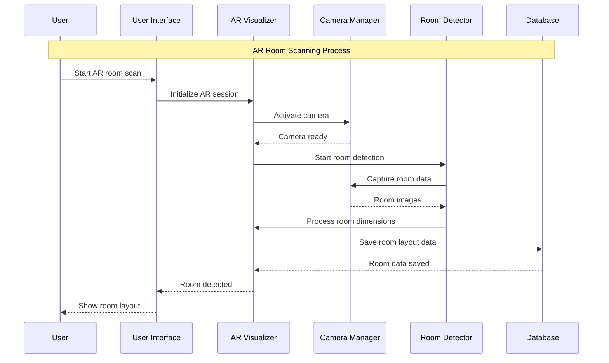
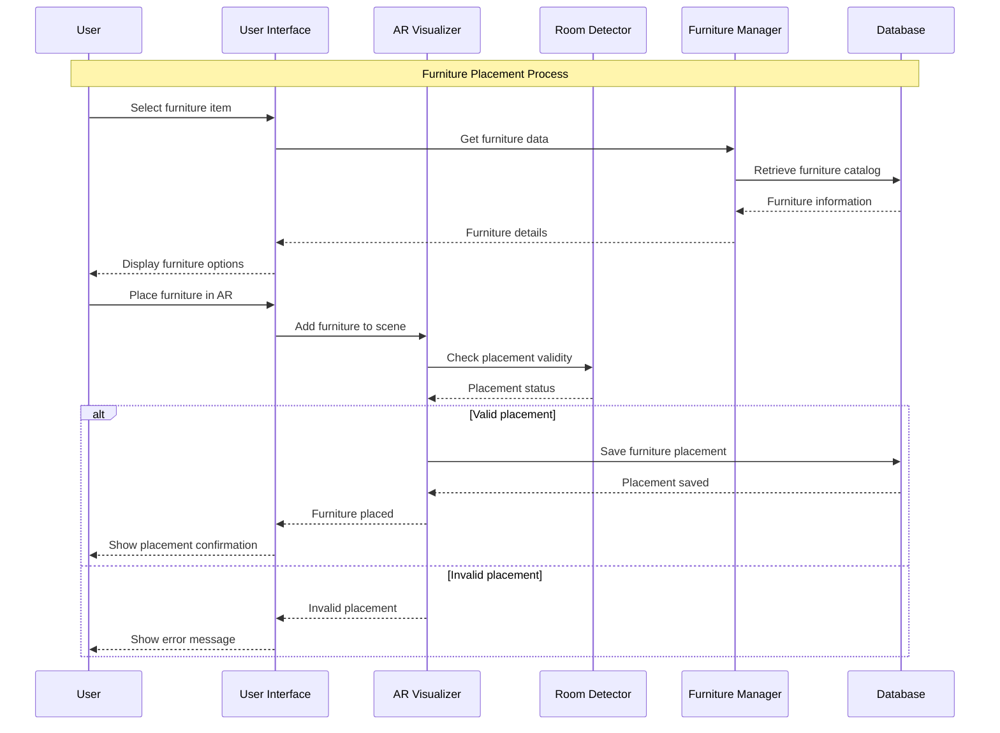
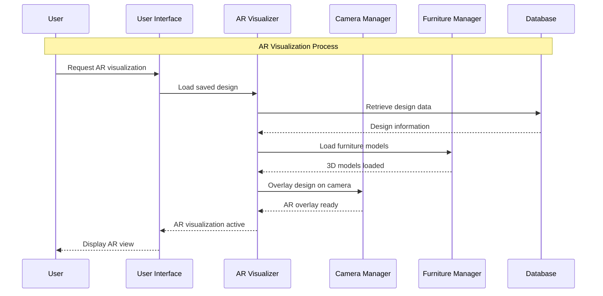
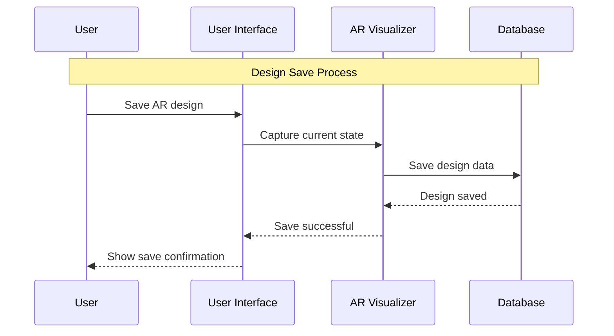

# AR Visualization Module - Sequence Diagrams

## 2.1 AR Room Scanning Sequence Diagram

## 2.2 Furniture Placement Sequence Diagram

## 2.3 AR Visualization Sequence Diagram

## 2.4 Design Save Sequence Diagram

