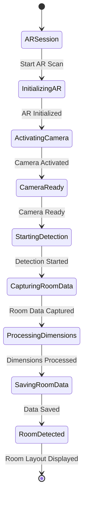
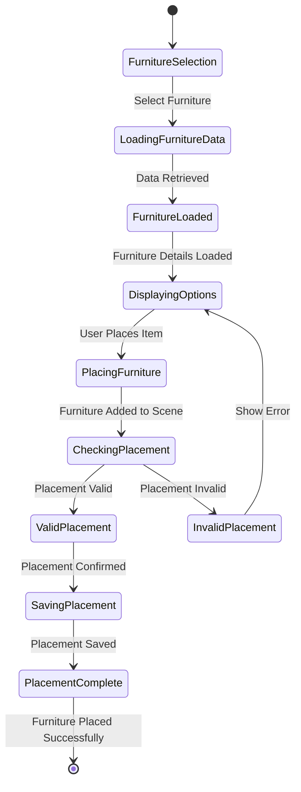
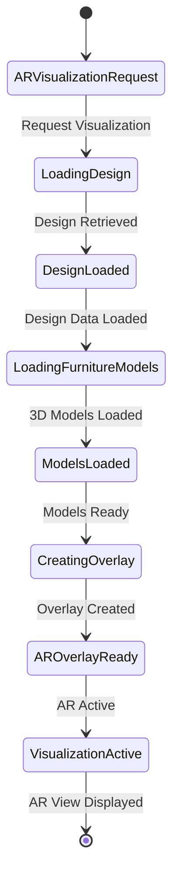
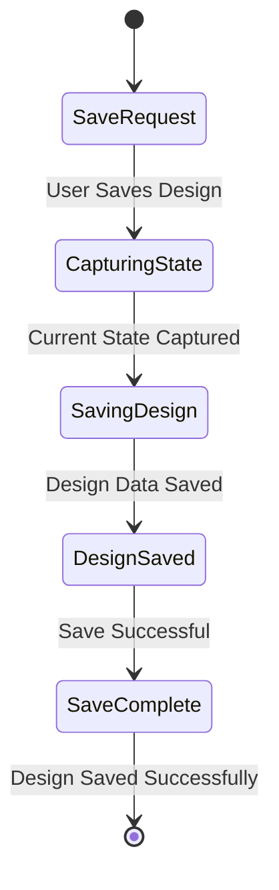

# AR Visualization Module - State Diagrams

## 2.1 AR Room Scanning State Diagram

## 2.2 Furniture Placement State Diagram

## 2.3 AR Visualization State Diagram

## 2.4 Design Save State Diagram

