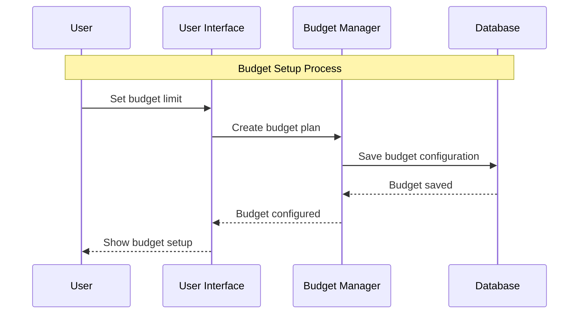
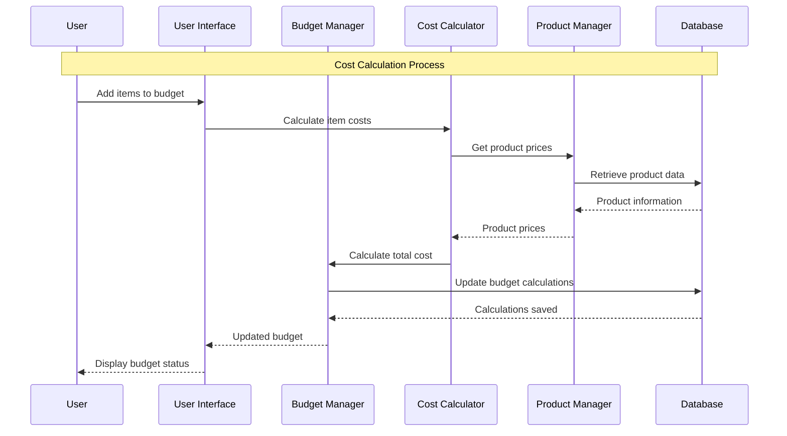
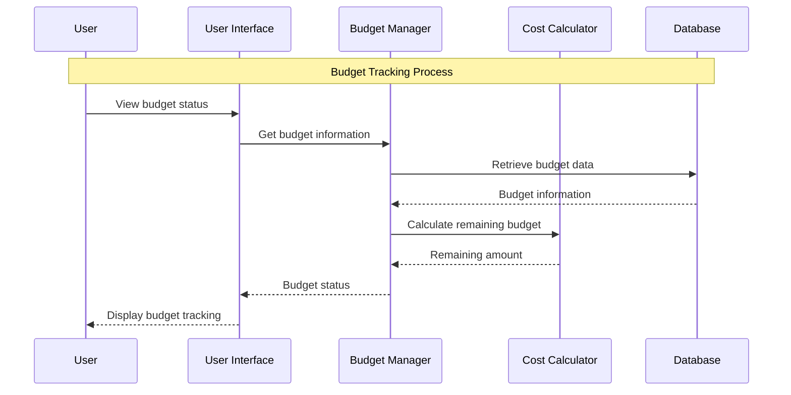
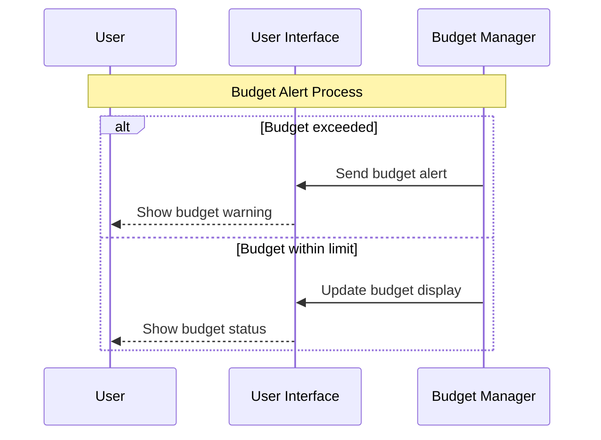
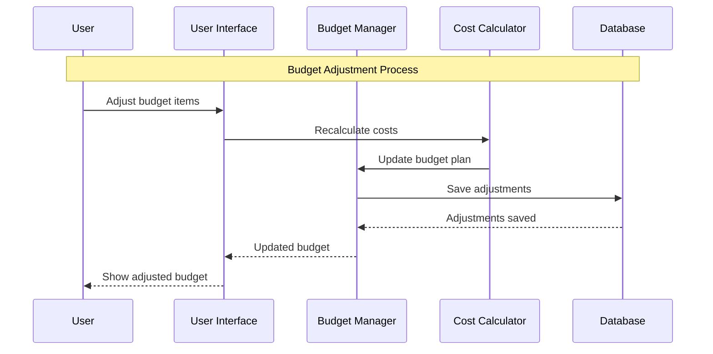

# Budget Calculation Module - Sequence Diagrams

## 5.1 Budget Setup Sequence Diagram

## 5.2 Cost Calculation Sequence Diagram

## 5.3 Budget Tracking Sequence Diagram

## 5.4 Budget Alert Sequence Diagram

## 5.5 Budget Adjustment Sequence Diagram

