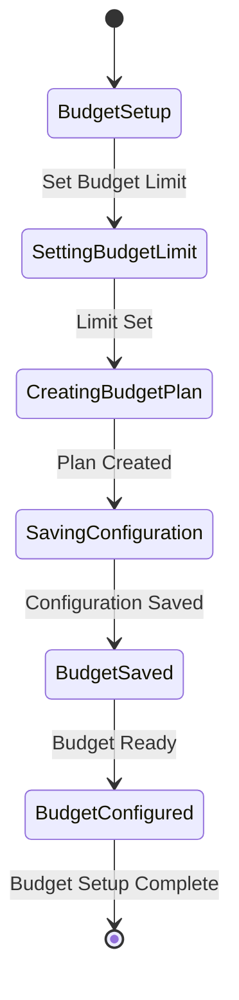
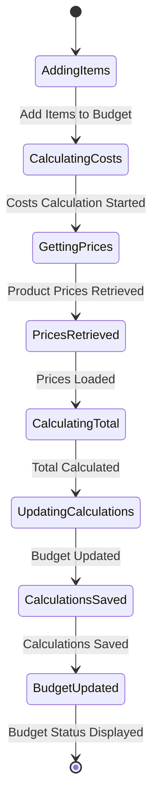
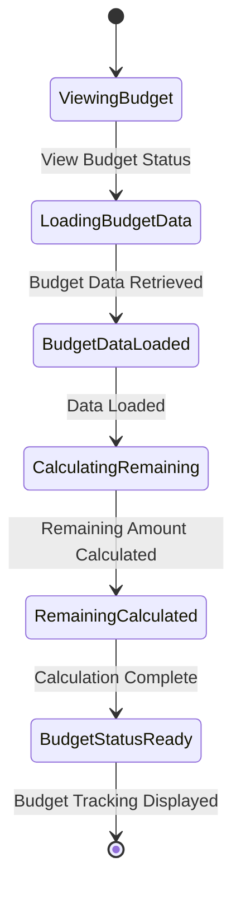
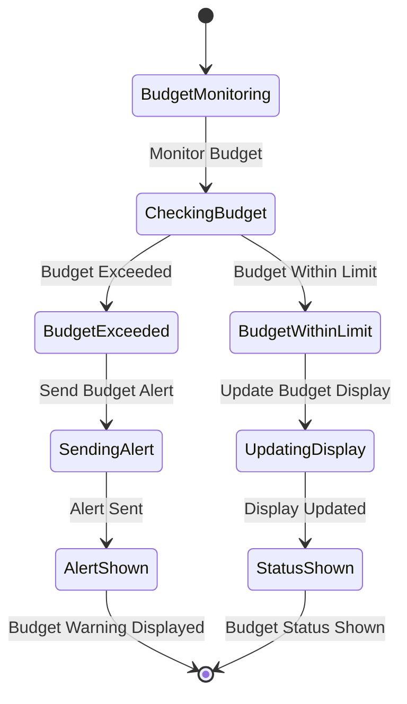
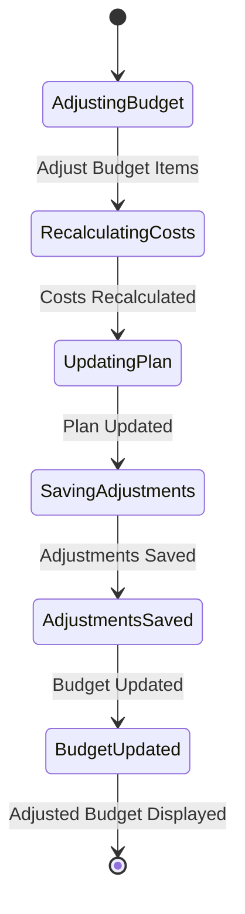

# Budget Calculation Module - State Diagrams

## 5.1 Budget Setup State Diagram

## 5.2 Cost Calculation State Diagram

## 5.3 Budget Tracking State Diagram

## 5.4 Budget Alert State Diagram

## 5.5 Budget Adjustment State Diagram

