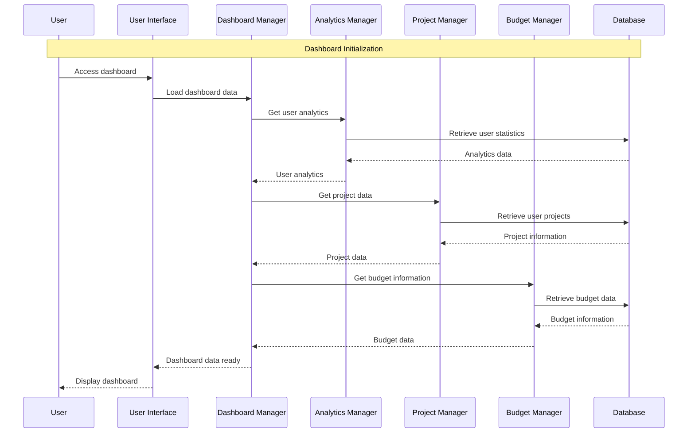
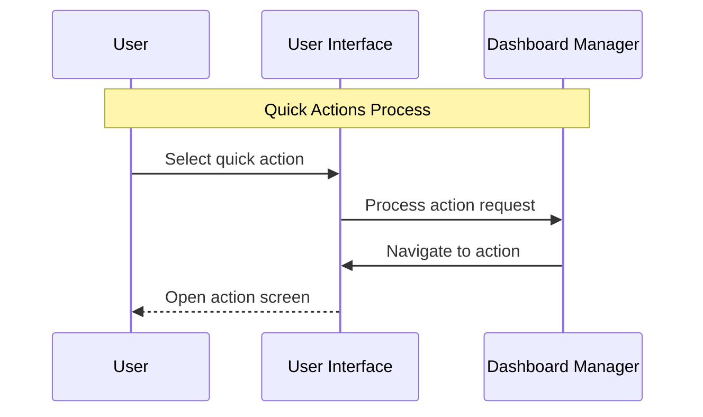
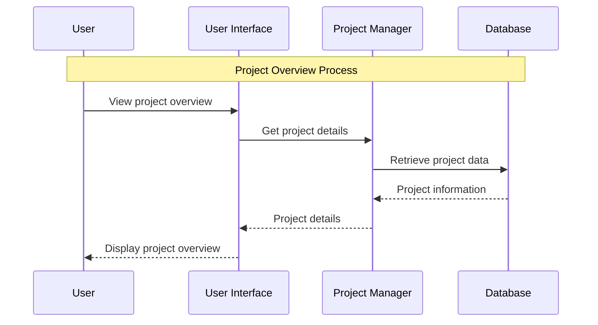
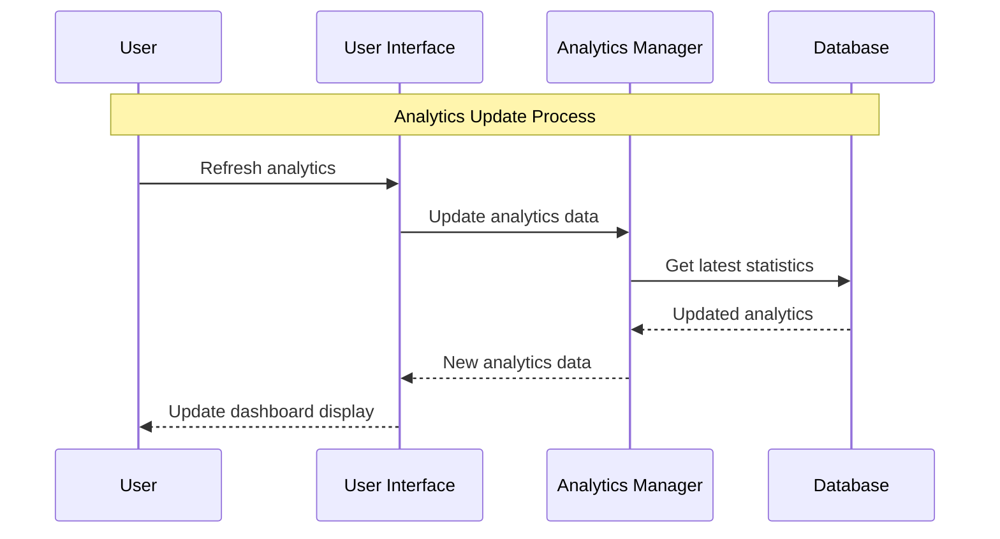

# Dashboard Module - Sequence Diagrams

## 4.1 Dashboard Initialization Sequence Diagram

## 4.2 Quick Actions Sequence Diagram

## 4.3 Project Overview Sequence Diagram

## 4.4 Analytics Update Sequence Diagram

