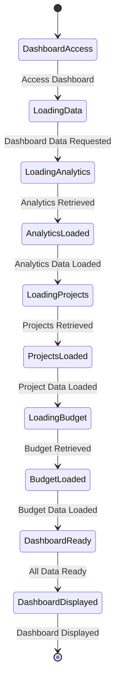
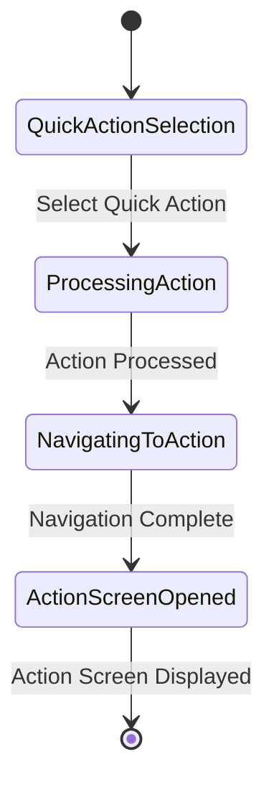
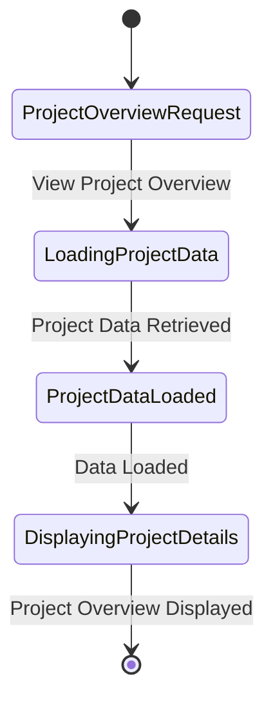
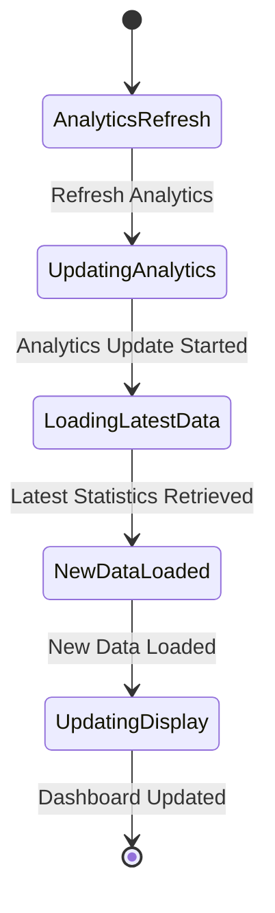

# Dashboard Module - State Diagrams

## 4.1 Dashboard Initialization State Diagram

## 4.2 Quick Actions State Diagram

## 4.3 Project Overview State Diagram

## 4.4 Analytics Update State Diagram

