# 🗄️ Entity Relationship Diagram (ERD)

## 📊 Interior Design Recommendation System ERD

```mermaid
erDiagram
    %% User Management
    User {
        string id PK
        string name
        string email
        string password
        string phone
        string address
        string role
        string profilePicture
        datetime createdAt
        datetime updatedAt
    }
    
    %% Supplier Management
    Supplier {
        string id PK
        string name
        string email
        string phone
        string address
        string businessLicense
        string description
        datetime createdAt
        datetime updatedAt
    }
    
    %% Product Management
    Product {
        string id PK
        string name
        string description
        int price
        int stock
        string image
        string category
        string designStyle
        string supplierId FK
        datetime createdAt
        datetime updatedAt
    }
    
    %% Order Management
    Order {
        string id PK
        string userId FK
        string supplierId FK
        double totalAmount
        string status
        string shippingAddress
        datetime orderDate
        datetime deliveryDate
        datetime createdAt
        datetime updatedAt
    }
    
    OrderItem {
        string id PK
        string orderId FK
        string productId FK
        int quantity
        double unitPrice
        double subtotal
    }
    
    %% Design Management
    SavedDesign {
        string id PK
        string userId FK
        string name
        string description
        string image
        string roomType
        string designStyle
        datetime createdAt
        datetime updatedAt
    }
    
    PlacedFurniture {
        string id PK
        string designId FK
        string furnitureId FK
        double xPosition
        double yPosition
        double rotation
        double scale
    }
    
    FurnitureItem {
        string id PK
        string name
        string category
        string image
        string description
        double width
        double height
        datetime createdAt
    }
    
    WallArea {
        string id PK
        string designId FK
        double xPosition
        double yPosition
        double width
        double height
        string color
        string textureId FK
    }
    
    WallTexture {
        string id PK
        string name
        string image
        string category
        string description
    }
    
    %% Budget Management
    Budget {
        string id PK
        string userId FK
        double totalBudget
        double spentAmount
        string currency
        datetime startDate
        datetime endDate
        datetime createdAt
        datetime updatedAt
    }
    
    BudgetItem {
        string id PK
        string budgetId FK
        string category
        double allocatedAmount
        double spentAmount
        string description
    }
    
    %% Chat/AI Messages
    ChatMessage {
        string id PK
        string userId FK
        string sender
        string message
        string messageType
        datetime timestamp
    }
    
    %% Purchase History
    PurchaseHistory {
        string id PK
        string userId FK
        string productId FK
        int quantity
        double totalPrice
        datetime purchaseDate
        string status
    }
    
    %% Analytics
    SalesAnalytics {
        string id PK
        string supplierId FK
        double totalSales
        int totalOrders
        double averageRating
        string period
        datetime date
    }
    
    %% Notification System
    Notification {
        string id PK
        string userId FK
        string title
        string message
        string type
        string status
        datetime createdAt
    }
    
    %% Receipt Management
    Receipt {
        string id PK
        string orderId FK
        string issuedBy
        datetime issueDate
        string paymentMethod
        double totalAmount
    }
    
    %% Relationships with Cardinality
    
    %% User Relationships (1 to Many)
    User ||--o{ Order : " "
    User ||--o{ SavedDesign : " "
    User ||--o{ Budget : " "
    User ||--o{ ChatMessage : " "
    User ||--o{ PurchaseHistory : " "
    User ||--o{ Notification : " "
    
    %% Supplier Relationships (1 to Many)
    Supplier ||--o{ Product : " "
    Supplier ||--o{ Order : " "
    Supplier ||--o{ SalesAnalytics : " "
    
    %% Product Relationships (1 to Many)
    Product ||--o{ OrderItem : " "
    Product ||--o{ PurchaseHistory : " "
    
    %% Order Relationships (1 to Many)
    Order ||--o{ OrderItem : " "
    Order ||--|| Receipt : " "
    
    %% SavedDesign Relationships (1 to Many)
    SavedDesign ||--o{ PlacedFurniture : " "
    SavedDesign ||--o{ WallArea : " "
    
    %% FurnitureItem Relationships (1 to Many)
    FurnitureItem ||--o{ PlacedFurniture : " "
    
    %% WallTexture Relationships (1 to Many)
    WallTexture ||--o{ WallArea : " "
    
    %% Budget Relationships (1 to Many)
    Budget ||--o{ BudgetItem : " "
```

## 📋 **ERD Implementation Notes for Draw.io**

### **🎯 Key Differences from Class Diagram:**

#### **1. ✅ ERD vs Class Diagram:**
- **ERD**: Focuses on **data entities** and **relationships**
- **No methods/functions** - only attributes
- **Primary Keys (PK)** and **Foreign Keys (FK)** clearly marked
- **Cardinality notation**: `||--o{` (one-to-many), `||--||` (one-to-one)

#### **2. ✅ Entity Attributes:**
- **Primary Keys**: `id` fields marked with `PK`
- **Foreign Keys**: Relationship fields marked with `FK`
- **Data Types**: `string`, `int`, `double`, `datetime`
- **No Methods**: Only data attributes included

#### **3. ✅ Relationship Types:**

##### **🔗 One-to-Many (||--o{):**
- **User → Order**: 1 user can place many orders
- **User → SavedDesign**: 1 user can create many designs
- **User → Budget**: 1 user can have many budgets
- **Supplier → Product**: 1 supplier can supply many products
- **Order → OrderItem**: 1 order can have many items
- **SavedDesign → PlacedFurniture**: 1 design can have many furniture pieces
- **Budget → BudgetItem**: 1 budget can have many budget items

##### **🔗 One-to-One (||--||):**
- **Order → Receipt**: 1 order has exactly 1 receipt

#### **4. ✅ Foreign Key Relationships:**
- **Product.supplierId** → **Supplier.id**
- **Order.userId** → **User.id**
- **Order.supplierId** → **Supplier.id**
- **OrderItem.orderId** → **Order.id**
- **OrderItem.productId** → **Product.id**
- **SavedDesign.userId** → **User.id**
- **PlacedFurniture.designId** → **SavedDesign.id**
- **PlacedFurniture.furnitureId** → **FurnitureItem.id**
- **WallArea.designId** → **SavedDesign.id**
- **WallArea.textureId** → **WallTexture.id**
- **Budget.userId** → **User.id**
- **BudgetItem.budgetId** → **Budget.id**
- **ChatMessage.userId** → **User.id**
- **PurchaseHistory.userId** → **User.id**
- **PurchaseHistory.productId** → **Product.id**
- **SalesAnalytics.supplierId** → **Supplier.id**
- **Notification.userId** → **User.id**
- **Receipt.orderId** → **Order.id**

### **🎨 Visual Guidelines for Draw.io:**

#### **1. ✅ Entity Boxes:**
- **Rectangular boxes** for entities
- **Entity name** at the top
- **Attributes listed** inside the box
- **Primary Keys** marked with `PK`
- **Foreign Keys** marked with `FK`

#### **2. ✅ Relationship Lines:**
- **Solid lines** with crow's foot notation
- **One-to-Many**: `||--o{` (line with crow's foot)
- **One-to-One**: `||--||` (line with bars on both ends)
- **Relationship labels** on the lines

#### **3. ✅ Cardinality Notation:**
- **`||`** = One (required)
- **`o`** = Zero (optional)
- **`{`** = Many (crow's foot)
- **`||--o{`** = One-to-Many
- **`||--||`** = One-to-One

### **📊 Database Implementation:**

#### **1. ✅ Primary Keys:**
- All entities have `id` as primary key
- Auto-incrementing or UUID format

#### **2. ✅ Foreign Keys:**
- Proper referential integrity
- Cascade delete/update as needed
- Indexed for performance

#### **3. ✅ Data Types:**
- **String**: Names, emails, descriptions
- **Integer**: Prices, quantities, stock
- **Double**: Amounts, positions, ratings
- **DateTime**: Timestamps, dates

This ERD provides the complete database schema for your Interior Design Recommendation System! 🎉 