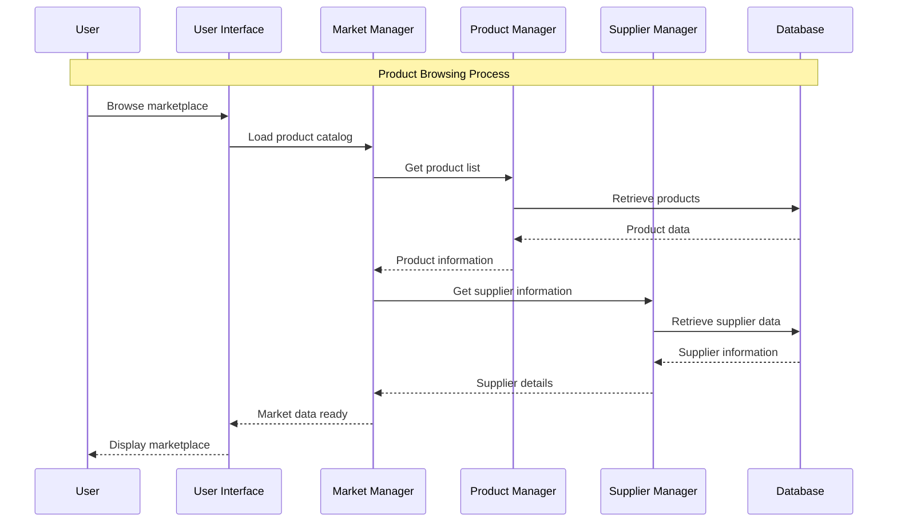
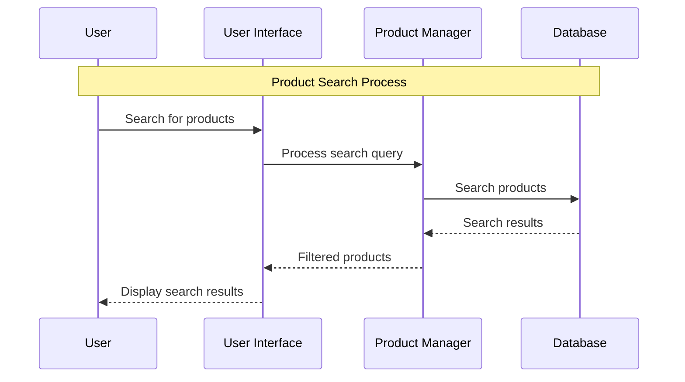
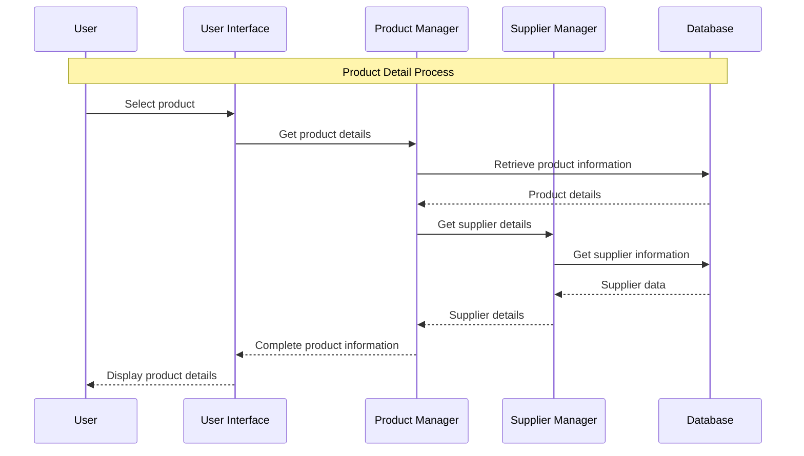
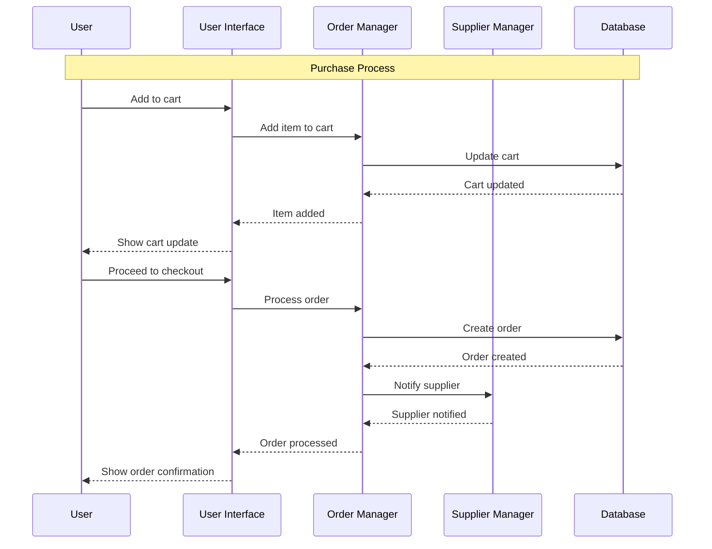
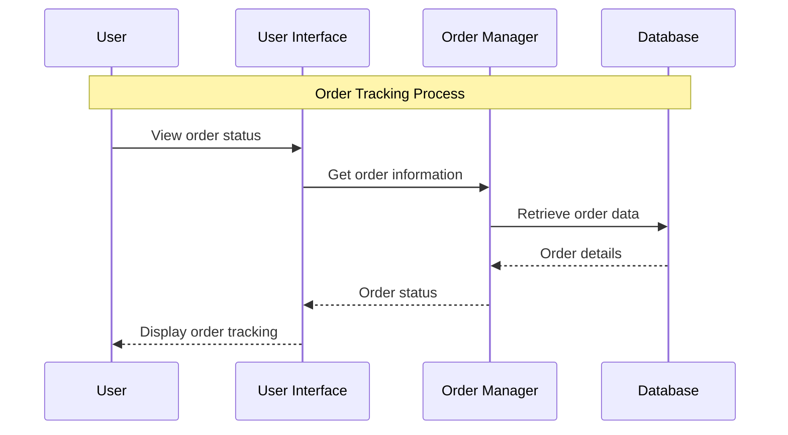
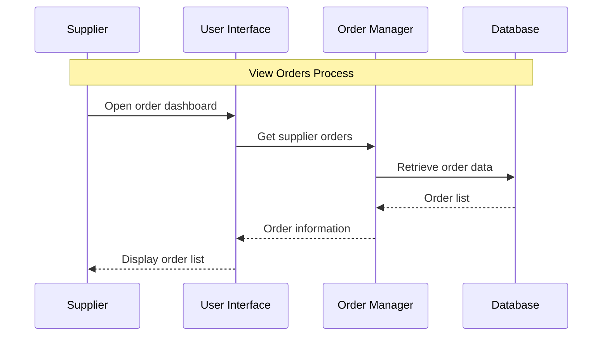

# Marketplace Module - Sequence Diagrams

## 6.1 Product Browsing Sequence Diagram

## 6.2 Product Search Sequence Diagram

## 6.3 Product Detail Sequence Diagram

## 6.4 Purchase Process Sequence Diagram

## 6.5 Order Tracking Sequence Diagram

## 6.6 View Orders (Supplier) Sequence Diagram

