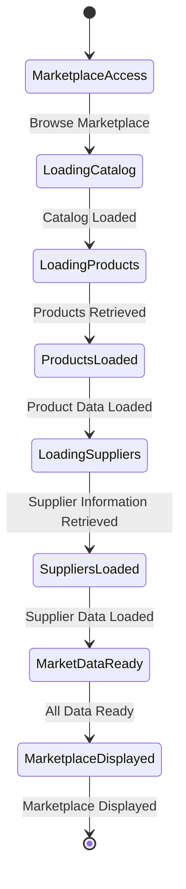
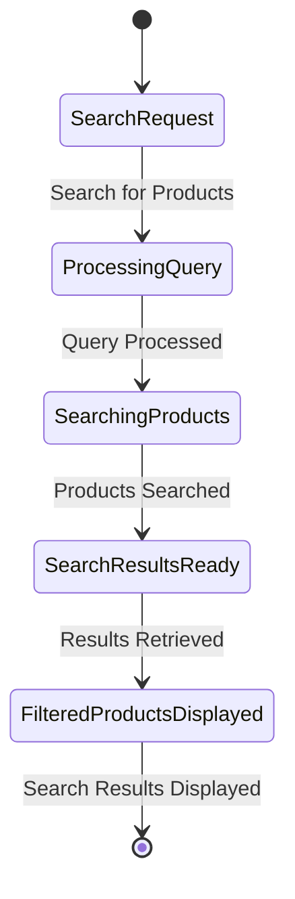
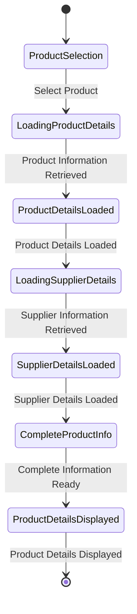
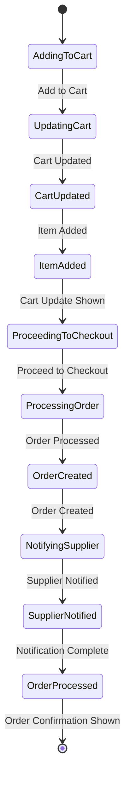
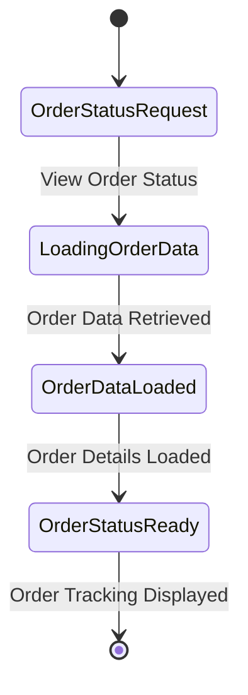
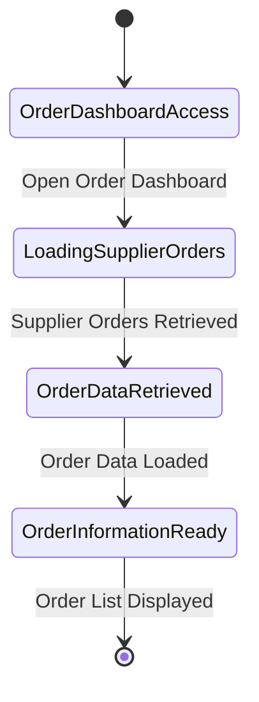

# Marketplace Module - State Diagrams

## 6.1 Product Browsing State Diagram

## 6.2 Product Search State Diagram

## 6.3 Product Detail State Diagram

## 6.4 Purchase Process State Diagram

## 6.5 Order Tracking State Diagram

## 6.6 View Orders (Supplier) State Diagram

