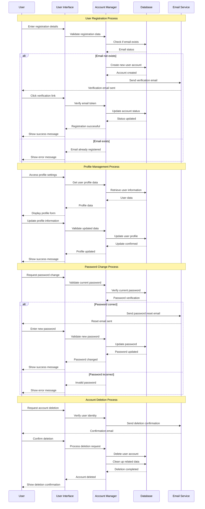
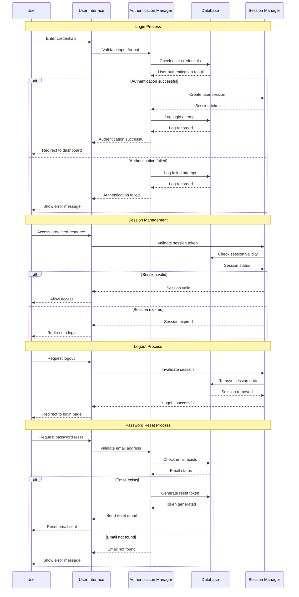
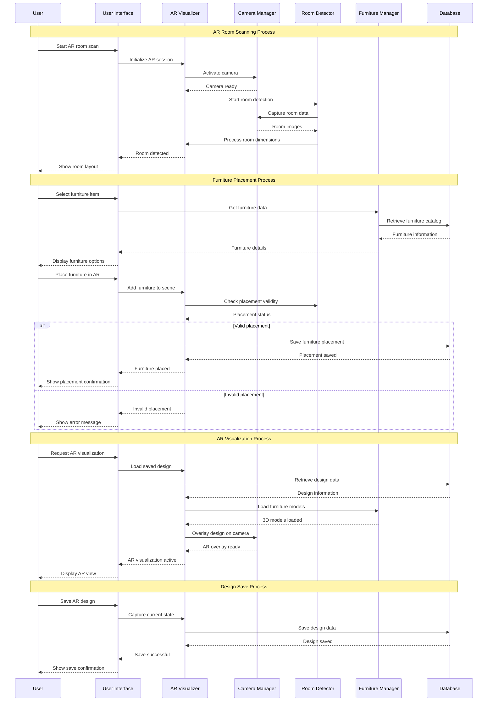
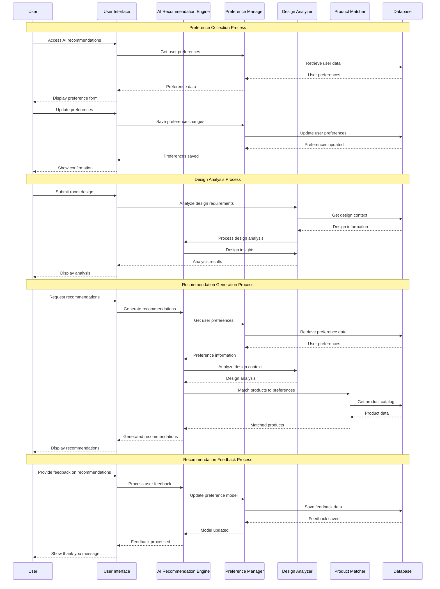
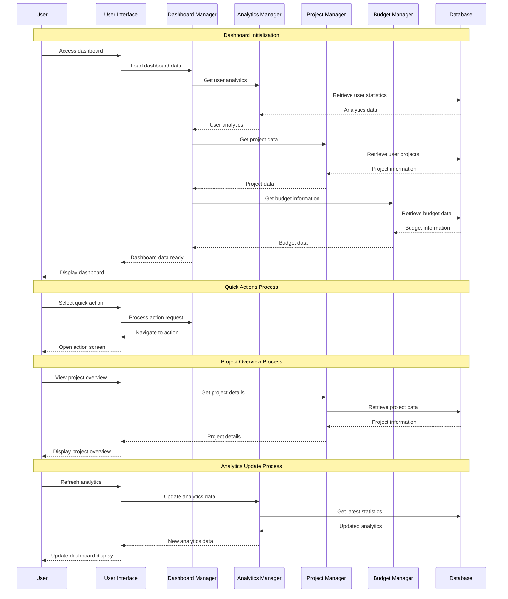
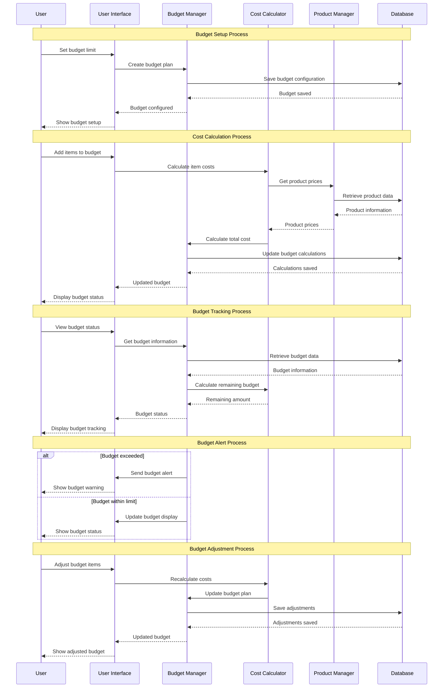
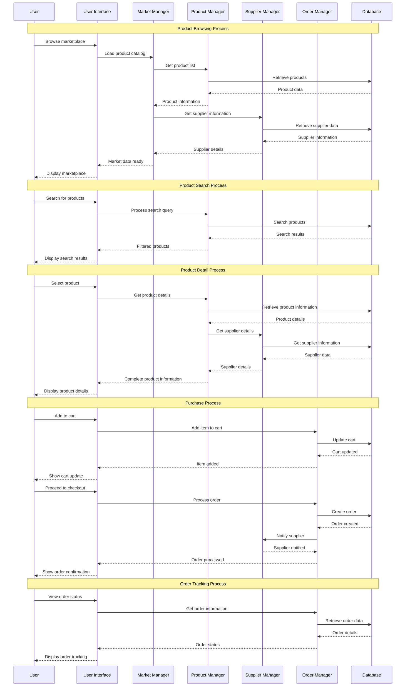

# 📊 Process Design - Sequence Diagrams

## 4.5 Process Design - Sequence Diagram

### 4.5.1 Account & Profile Management Module

### 4.5.2 Authentication Module

### 4.5.3 AR Visualize Module

### 4.5.4 AI Recommendation Module

### 4.5.5 Dashboard Module

### 4.5.6 Budget Calculation Module

### 4.5.7 Market Module

---

## 📋 Import Instructions for draw.io

1. **Copy the Mermaid code** from any section above
2. **Open draw.io** in your browser
3. **Create a new diagram** or open existing one
4. **Go to File > Import From > Text**
5. **Paste the Mermaid code** in the text area
6. **Click Import** to add the sequence diagram to your diagram

## 🔧 Customization Notes

- **Actors/Objects**: You can modify participant names to match your specific system components
- **Messages**: Update message descriptions to reflect your exact business processes
- **Flow**: Adjust the sequence flow based on your specific implementation requirements
- **Error Handling**: Add additional alt/else blocks for error scenarios as needed

## 📊 Diagram Features

Each sequence diagram includes:
- ✅ **Clear participant identification**
- ✅ **Logical process flow**
- ✅ **Database interactions**
- ✅ **Error handling scenarios**
- ✅ **User interface interactions**
- ✅ **Service layer communications** 