# Software Architecture Diagrams

## 4.6 Software Architecture Diagram

### 4.6.1 Package Diagram

```mermaid
graph TB
    subgraph "SystemUI"
        subgraph "Authentication UI"
            FORGOT_PASSWORD_UI[ForgotPasswordUI]
            LOGIN_UI[LoginUI]
        end
        
        subgraph "User Role UI"
            HOMEOWNER_UI[HomeownerUI]
            SUPPLIER_UI[SupplierUI]
        end
        
        subgraph "Homeowner UI Modules"
            DASHBOARD_UI[DashboardUI]
            AR_VISUALIZATION_UI[ARVisualizationUI]
            AI_RECOMMENDATION_UI[AIRecommendationUI]
            MARKETPLACE_UI[MarketplaceUI]
            BUDGET_UI[BudgetUI]
            DESIGN_UI[DesignUI]
        end
        
        subgraph "Supplier UI Modules"
            SUPPLIER_DASHBOARD_UI[SupplierDashboardUI]
            PRODUCT_MANAGEMENT_UI[ProductManagementUI]
            ORDER_MANAGEMENT_UI[OrderManagementUI]
            ANALYTICS_UI[AnalyticsUI]
            INVENTORY_UI[InventoryUI]
        end
        
        subgraph "AR Visualization Sub-modules"
            CAMERA_UI[CameraUI]
            FURNITURE_PLACEMENT_UI[FurniturePlacementUI]
            ROOM_SCAN_UI[RoomScanUI]
            DESIGN_SAVE_UI[DesignSaveUI]
        end
        
        subgraph "AI Recommendation Sub-modules"
            PREFERENCE_UI[PreferenceUI]
            STYLE_MATCHING_UI[StyleMatchingUI]
            COLOR_ANALYSIS_UI[ColorAnalysisUI]
            RECOMMENDATION_LIST_UI[RecommendationListUI]
        end
        
        subgraph "Marketplace Sub-modules"
            PRODUCT_CATALOG_UI[ProductCatalogUI]
            SHOPPING_CART_UI[ShoppingCartUI]
            ORDER_PROCESSING_UI[OrderProcessingUI]
            PAYMENT_UI[PaymentUI]
        end
        
        subgraph "Dashboard Sub-modules"
            ANALYTICS_DASHBOARD_UI[AnalyticsDashboardUI]
            PROJECT_MANAGEMENT_UI[ProjectManagementUI]
            REPORT_UI[ReportUI]
            QUICK_ACTIONS_UI[QuickActionsUI]
        end
        
        subgraph "Budget Sub-modules"
            BUDGET_PLANNING_UI[BudgetPlanningUI]
            COST_TRACKING_UI[CostTrackingUI]
            EXPENSE_ANALYSIS_UI[ExpenseAnalysisUI]
            ALERT_UI[AlertUI]
        end
    end
    
    subgraph "SystemCtrl"
        subgraph "Authentication Ctrl"
            FORGOT_PASSWORD_CTRL[ForgotPasswordCtrl]
            LOGIN_CTRL[LoginCtrl]
        end
        
        subgraph "User Role Ctrl"
            HOMEOWNER_CTRL[HomeownerCtrl]
            SUPPLIER_CTRL[SupplierCtrl]
        end
        
        subgraph "Homeowner Ctrl Modules"
            DASHBOARD_CTRL[DashboardCtrl]
            AR_VISUALIZATION_CTRL[ARVisualizationCtrl]
            AI_RECOMMENDATION_CTRL[AIRecommendationCtrl]
            MARKETPLACE_CTRL[MarketplaceCtrl]
            BUDGET_CTRL[BudgetCtrl]
            DESIGN_CTRL[DesignCtrl]
        end
        
        subgraph "Supplier Ctrl Modules"
            SUPPLIER_DASHBOARD_CTRL[SupplierDashboardCtrl]
            PRODUCT_MANAGEMENT_CTRL[ProductManagementCtrl]
            ORDER_MANAGEMENT_CTRL[OrderManagementCtrl]
            ANALYTICS_CTRL[AnalyticsCtrl]
            INVENTORY_CTRL[InventoryCtrl]
        end
        
        subgraph "AR Visualization Sub-ctrl"
            CAMERA_CTRL[CameraCtrl]
            FURNITURE_PLACEMENT_CTRL[FurniturePlacementCtrl]
            ROOM_SCAN_CTRL[RoomScanCtrl]
            DESIGN_SAVE_CTRL[DesignSaveCtrl]
        end
        
        subgraph "AI Recommendation Sub-ctrl"
            PREFERENCE_CTRL[PreferenceCtrl]
            STYLE_MATCHING_CTRL[StyleMatchingCtrl]
            COLOR_ANALYSIS_CTRL[ColorAnalysisCtrl]
            RECOMMENDATION_LIST_CTRL[RecommendationListCtrl]
        end
        
        subgraph "Marketplace Sub-ctrl"
            PRODUCT_CATALOG_CTRL[ProductCatalogCtrl]
            SHOPPING_CART_CTRL[ShoppingCartCtrl]
            ORDER_PROCESSING_CTRL[OrderProcessingCtrl]
            PAYMENT_CTRL[PaymentCtrl]
        end
        
        subgraph "Dashboard Sub-ctrl"
            ANALYTICS_DASHBOARD_CTRL[AnalyticsDashboardCtrl]
            PROJECT_MANAGEMENT_CTRL[ProjectManagementCtrl]
            REPORT_CTRL[ReportCtrl]
            QUICK_ACTIONS_CTRL[QuickActionsCtrl]
        end
        
        subgraph "Budget Sub-ctrl"
            BUDGET_PLANNING_CTRL[BudgetPlanningCtrl]
            COST_TRACKING_CTRL[CostTrackingCtrl]
            EXPENSE_ANALYSIS_CTRL[ExpenseAnalysisCtrl]
            ALERT_CTRL[AlertCtrl]
        end
    end
    
    subgraph "Database Layer"
        subgraph "User Database"
            USER_TABLE[UserTable]
            SESSION_TABLE[SessionTable]
            PREFERENCE_TABLE[PreferenceTable]
        end
        
        subgraph "Design Database"
            DESIGN_TABLE[DesignTable]
            ROOM_TABLE[RoomTable]
            FURNITURE_TABLE[FurnitureTable]
            AR_MODEL_TABLE[ARModelTable]
        end
        
        subgraph "Product Database"
            PRODUCT_TABLE[ProductTable]
            CATEGORY_TABLE[CategoryTable]
            SUPPLIER_TABLE[SupplierTable]
            INVENTORY_TABLE[InventoryTable]
        end
        
        subgraph "Order Database"
            ORDER_TABLE[OrderTable]
            ORDER_ITEM_TABLE[OrderItemTable]
            PAYMENT_TABLE[PaymentTable]
            SHIPPING_TABLE[ShippingTable]
        end
        
        subgraph "Analytics Database"
            ANALYTICS_TABLE[AnalyticsTable]
            REPORT_TABLE[ReportTable]
            METRICS_TABLE[MetricsTable]
            LOG_TABLE[LogTable]
        end
        
        subgraph "Budget Database"
            BUDGET_TABLE[BudgetTable]
            EXPENSE_TABLE[ExpenseTable]
            COST_TABLE[CostTable]
            ALERT_TABLE[AlertTable]
        end
    end
    
    %% SystemUI Connections
    FORGOT_PASSWORD_UI -.-> LOGIN_UI
    LOGIN_UI -.-> HOMEOWNER_UI
    LOGIN_UI -.-> SUPPLIER_UI
    
    HOMEOWNER_UI -.-> DASHBOARD_UI
    HOMEOWNER_UI -.-> AR_VISUALIZATION_UI
    HOMEOWNER_UI -.-> AI_RECOMMENDATION_UI
    HOMEOWNER_UI -.-> MARKETPLACE_UI
    HOMEOWNER_UI -.-> BUDGET_UI
    HOMEOWNER_UI -.-> DESIGN_UI
    
    SUPPLIER_UI -.-> SUPPLIER_DASHBOARD_UI
    SUPPLIER_UI -.-> PRODUCT_MANAGEMENT_UI
    SUPPLIER_UI -.-> ORDER_MANAGEMENT_UI
    SUPPLIER_UI -.-> ANALYTICS_UI
    SUPPLIER_UI -.-> INVENTORY_UI
    
    AR_VISUALIZATION_UI -.-> CAMERA_UI
    AR_VISUALIZATION_UI -.-> FURNITURE_PLACEMENT_UI
    AR_VISUALIZATION_UI -.-> ROOM_SCAN_UI
    AR_VISUALIZATION_UI -.-> DESIGN_SAVE_UI
    
    AI_RECOMMENDATION_UI -.-> PREFERENCE_UI
    AI_RECOMMENDATION_UI -.-> STYLE_MATCHING_UI
    AI_RECOMMENDATION_UI -.-> COLOR_ANALYSIS_UI
    AI_RECOMMENDATION_UI -.-> RECOMMENDATION_LIST_UI
    
    MARKETPLACE_UI -.-> PRODUCT_CATALOG_UI
    MARKETPLACE_UI -.-> SHOPPING_CART_UI
    MARKETPLACE_UI -.-> ORDER_PROCESSING_UI
    MARKETPLACE_UI -.-> PAYMENT_UI
    
    DASHBOARD_UI -.-> ANALYTICS_DASHBOARD_UI
    DASHBOARD_UI -.-> PROJECT_MANAGEMENT_UI
    DASHBOARD_UI -.-> REPORT_UI
    DASHBOARD_UI -.-> QUICK_ACTIONS_UI
    
    BUDGET_UI -.-> BUDGET_PLANNING_UI
    BUDGET_UI -.-> COST_TRACKING_UI
    BUDGET_UI -.-> EXPENSE_ANALYSIS_UI
    BUDGET_UI -.-> ALERT_UI
    
    %% SystemCtrl Connections
    FORGOT_PASSWORD_CTRL -.-> LOGIN_CTRL
    LOGIN_CTRL -.-> HOMEOWNER_CTRL
    LOGIN_CTRL -.-> SUPPLIER_CTRL
    
    HOMEOWNER_CTRL -.-> DASHBOARD_CTRL
    HOMEOWNER_CTRL -.-> AR_VISUALIZATION_CTRL
    HOMEOWNER_CTRL -.-> AI_RECOMMENDATION_CTRL
    HOMEOWNER_CTRL -.-> MARKETPLACE_CTRL
    HOMEOWNER_CTRL -.-> BUDGET_CTRL
    HOMEOWNER_CTRL -.-> DESIGN_CTRL
    
    SUPPLIER_CTRL -.-> SUPPLIER_DASHBOARD_CTRL
    SUPPLIER_CTRL -.-> PRODUCT_MANAGEMENT_CTRL
    SUPPLIER_CTRL -.-> ORDER_MANAGEMENT_CTRL
    SUPPLIER_CTRL -.-> ANALYTICS_CTRL
    SUPPLIER_CTRL -.-> INVENTORY_CTRL
    
    AR_VISUALIZATION_CTRL -.-> CAMERA_CTRL
    AR_VISUALIZATION_CTRL -.-> FURNITURE_PLACEMENT_CTRL
    AR_VISUALIZATION_CTRL -.-> ROOM_SCAN_CTRL
    AR_VISUALIZATION_CTRL -.-> DESIGN_SAVE_CTRL
    
    AI_RECOMMENDATION_CTRL -.-> PREFERENCE_CTRL
    AI_RECOMMENDATION_CTRL -.-> STYLE_MATCHING_CTRL
    AI_RECOMMENDATION_CTRL -.-> COLOR_ANALYSIS_CTRL
    AI_RECOMMENDATION_CTRL -.-> RECOMMENDATION_LIST_CTRL
    
    MARKETPLACE_CTRL -.-> PRODUCT_CATALOG_CTRL
    MARKETPLACE_CTRL -.-> SHOPPING_CART_CTRL
    MARKETPLACE_CTRL -.-> ORDER_PROCESSING_CTRL
    MARKETPLACE_CTRL -.-> PAYMENT_CTRL
    
    DASHBOARD_CTRL -.-> ANALYTICS_DASHBOARD_CTRL
    DASHBOARD_CTRL -.-> PROJECT_MANAGEMENT_CTRL
    DASHBOARD_CTRL -.-> REPORT_CTRL
    DASHBOARD_CTRL -.-> QUICK_ACTIONS_CTRL
    
    BUDGET_CTRL -.-> BUDGET_PLANNING_CTRL
    BUDGET_CTRL -.-> COST_TRACKING_CTRL
    BUDGET_CTRL -.-> EXPENSE_ANALYSIS_CTRL
    BUDGET_CTRL -.-> ALERT_CTRL
    
    %% Information Flow between SystemUI and SystemCtrl
    FORGOT_PASSWORD_UI -.-> FORGOT_PASSWORD_CTRL
    LOGIN_UI -.-> LOGIN_CTRL
    HOMEOWNER_UI -.-> HOMEOWNER_CTRL
    SUPPLIER_UI -.-> SUPPLIER_CTRL
    DASHBOARD_UI -.-> DASHBOARD_CTRL
    AR_VISUALIZATION_UI -.-> AR_VISUALIZATION_CTRL
    AI_RECOMMENDATION_UI -.-> AI_RECOMMENDATION_CTRL
    MARKETPLACE_UI -.-> MARKETPLACE_CTRL
    BUDGET_UI -.-> BUDGET_CTRL
    DESIGN_UI -.-> DESIGN_CTRL
    
    %% SystemCtrl to Database Layer connections
    LOGIN_CTRL -.-> USER_TABLE
    LOGIN_CTRL -.-> SESSION_TABLE
    HOMEOWNER_CTRL -.-> PREFERENCE_TABLE
    SUPPLIER_CTRL -.-> SUPPLIER_TABLE
    
    AR_VISUALIZATION_CTRL -.-> DESIGN_TABLE
    AR_VISUALIZATION_CTRL -.-> ROOM_TABLE
    AR_VISUALIZATION_CTRL -.-> FURNITURE_TABLE
    AR_VISUALIZATION_CTRL -.-> AR_MODEL_TABLE
    
    AI_RECOMMENDATION_CTRL -.-> PREFERENCE_TABLE
    AI_RECOMMENDATION_CTRL -.-> DESIGN_TABLE
    AI_RECOMMENDATION_CTRL -.-> PRODUCT_TABLE
    
    MARKETPLACE_CTRL -.-> PRODUCT_TABLE
    MARKETPLACE_CTRL -.-> CATEGORY_TABLE
    MARKETPLACE_CTRL -.-> INVENTORY_TABLE
    ORDER_PROCESSING_CTRL -.-> ORDER_TABLE
    ORDER_PROCESSING_CTRL -.-> ORDER_ITEM_TABLE
    PAYMENT_CTRL -.-> PAYMENT_TABLE
    PAYMENT_CTRL -.-> SHIPPING_TABLE
    
    DASHBOARD_CTRL -.-> ANALYTICS_TABLE
    DASHBOARD_CTRL -.-> REPORT_TABLE
    DASHBOARD_CTRL -.-> METRICS_TABLE
    DASHBOARD_CTRL -.-> LOG_TABLE
    
    BUDGET_CTRL -.-> BUDGET_TABLE
    BUDGET_CTRL -.-> EXPENSE_TABLE
    BUDGET_CTRL -.-> COST_TABLE
    BUDGET_CTRL -.-> ALERT_TABLE
    
    PRODUCT_MANAGEMENT_CTRL -.-> PRODUCT_TABLE
    PRODUCT_MANAGEMENT_CTRL -.-> CATEGORY_TABLE
    PRODUCT_MANAGEMENT_CTRL -.-> INVENTORY_TABLE
    
    ORDER_MANAGEMENT_CTRL -.-> ORDER_TABLE
    ORDER_MANAGEMENT_CTRL -.-> ORDER_ITEM_TABLE
    
    ANALYTICS_CTRL -.-> ANALYTICS_TABLE
    ANALYTICS_CTRL -.-> REPORT_TABLE
    ANALYTICS_CTRL -.-> METRICS_TABLE
    
    INVENTORY_CTRL -.-> INVENTORY_TABLE
    INVENTORY_CTRL -.-> PRODUCT_TABLE
```

### 4.6.2 Deployment Diagram

```mermaid
graph TB
    subgraph "Client Devices"
        subgraph "Mobile Application"
            MOBILE_APP[Flutter Mobile App]
            MOBILE_AR[AR Camera Module]
            MOBILE_UI[Mobile UI Components]
        end
        
        subgraph "Web Application"
            WEB_APP[Web Application]
            WEB_UI[Web UI Components]
            WEB_DASHBOARD[Web Dashboard]
        end
    end
    
    subgraph "Cloud Infrastructure"
        subgraph "Load Balancer"
            LB[Load Balancer]
        end
        
        subgraph "Application Servers"
            subgraph "API Gateway"
                API_GATEWAY[API Gateway]
                API_AUTH[Authentication API]
                API_AR[AR Services API]
                API_AI[AI Services API]
                API_MARKET[Marketplace API]
                API_BUDGET[Budget API]
            end
            
            subgraph "Microservices"
                AUTH_SERVICE[Authentication Service]
                AR_SERVICE[AR Visualization Service]
                AI_SERVICE[AI Recommendation Service]
                DASHBOARD_SERVICE[Dashboard Service]
                MARKETPLACE_SERVICE[Marketplace Service]
                BUDGET_SERVICE[Budget Service]
                EMAIL_SERVICE[Email Service]
            end
        end
        
        subgraph "Database Layer"
            subgraph "Primary Database"
                DB_MAIN[Main Database]
                DB_USER_DATA[User Data]
                DB_PRODUCT_DATA[Product Data]
                DB_ORDER_DATA[Order Data]
                DB_DESIGN_DATA[Design Data]
                DB_BUDGET_DATA[Budget Data]
            end
            
            subgraph "Cache Layer"
                REDIS_CACHE[Redis Cache]
                SESSION_CACHE[Session Cache]
                PRODUCT_CACHE[Product Cache]
            end
            
            subgraph "File Storage"
                CLOUD_STORAGE[Cloud Storage]
                IMAGE_STORAGE[Image Storage]
                AR_MODEL_STORAGE[AR Model Storage]
            end
        end
        
        subgraph "External Services"
            AI_MODEL_SERVICE[AI Model Service]
            AR_FRAMEWORK_SERVICE[AR Framework Service]
            PAYMENT_SERVICE[Payment Gateway]
            EMAIL_PROVIDER[Email Provider]
        end
    end
    
    subgraph "Development & Testing"
        DEV_SERVER[Development Server]
        TEST_SERVER[Testing Server]
        CI_CD[CI/CD Pipeline]
    end
    
    MOBILE_APP --> LB
    WEB_APP --> LB
    LB --> API_GATEWAY
    
    API_GATEWAY --> AUTH_SERVICE
    API_GATEWAY --> AR_SERVICE
    API_GATEWAY --> AI_SERVICE
    API_GATEWAY --> DASHBOARD_SERVICE
    API_GATEWAY --> MARKETPLACE_SERVICE
    API_GATEWAY --> BUDGET_SERVICE
    API_GATEWAY --> EMAIL_SERVICE
    
    AUTH_SERVICE --> DB_MAIN
    AR_SERVICE --> DB_MAIN
    AI_SERVICE --> DB_MAIN
    DASHBOARD_SERVICE --> DB_MAIN
    MARKETPLACE_SERVICE --> DB_MAIN
    BUDGET_SERVICE --> DB_MAIN
    
    AUTH_SERVICE --> REDIS_CACHE
    MARKETPLACE_SERVICE --> REDIS_CACHE
    
    AR_SERVICE --> CLOUD_STORAGE
    MARKETPLACE_SERVICE --> CLOUD_STORAGE
    
    AI_SERVICE --> AI_MODEL_SERVICE
    AR_SERVICE --> AR_FRAMEWORK_SERVICE
    MARKETPLACE_SERVICE --> PAYMENT_SERVICE
    EMAIL_SERVICE --> EMAIL_PROVIDER
    
    DEV_SERVER --> TEST_SERVER
    TEST_SERVER --> CI_CD
```

### 4.6.3 Component Diagram

```mermaid
graph TB
    subgraph "Interior Design Recommendation System Components"
        subgraph "User Interface Components"
            UI_LOGIN[Login Component]
            UI_REGISTER[Registration Component]
            UI_PROFILE[Profile Component]
            UI_DASHBOARD[Dashboard Component]
            UI_AR[AR Visualization Component]
            UI_AI[AI Recommendation Component]
            UI_MARKETPLACE[Marketplace Component]
            UI_BUDGET[Budget Component]
        end
        
        subgraph "Authentication Components"
            AUTH_MANAGER[Authentication Manager]
            SESSION_MANAGER[Session Manager]
            PASSWORD_MANAGER[Password Manager]
            EMAIL_VERIFICATION[Email Verification]
        end
        
        subgraph "AR Visualization Components"
            AR_CORE[AR Core Engine]
            CAMERA_MANAGER[Camera Manager]
            ROOM_DETECTOR[Room Detector]
            FURNITURE_PLACER[Furniture Placer]
            DESIGN_SAVER[Design Saver]
        end
        
        subgraph "AI Recommendation Components"
            AI_ENGINE[AI Recommendation Engine]
            PREFERENCE_MANAGER[Preference Manager]
            DESIGN_ANALYZER[Design Analyzer]
            PRODUCT_MATCHER[Product Matcher]
            FEEDBACK_PROCESSOR[Feedback Processor]
        end
        
        subgraph "Dashboard Components"
            DASHBOARD_MANAGER[Dashboard Manager]
            ANALYTICS_MANAGER[Analytics Manager]
            PROJECT_MANAGER[Project Manager]
            QUICK_ACTIONS[Quick Actions]
        end
        
        subgraph "Marketplace Components"
            MARKET_MANAGER[Market Manager]
            PRODUCT_CATALOG[Product Catalog]
            SEARCH_ENGINE[Search Engine]
            CART_MANAGER[Cart Manager]
            ORDER_PROCESSOR[Order Processor]
            SUPPLIER_MANAGER[Supplier Manager]
        end
        
        subgraph "Budget Components"
            BUDGET_MANAGER[Budget Manager]
            COST_CALCULATOR[Cost Calculator]
            BUDGET_TRACKER[Budget Tracker]
            ALERT_SYSTEM[Alert System]
        end
        
        subgraph "Data Access Components"
            USER_REPOSITORY[User Repository]
            PRODUCT_REPOSITORY[Product Repository]
            ORDER_REPOSITORY[Order Repository]
            DESIGN_REPOSITORY[Design Repository]
            BUDGET_REPOSITORY[Budget Repository]
        end
        
        subgraph "External Service Components"
            EMAIL_SERVICE[Email Service]
            AR_FRAMEWORK[AR Framework]
            AI_MODEL[AI Model Service]
            PAYMENT_GATEWAY[Payment Gateway]
            CLOUD_STORAGE[Cloud Storage]
        end
    end
    
    UI_LOGIN --> AUTH_MANAGER
    UI_REGISTER --> AUTH_MANAGER
    UI_PROFILE --> AUTH_MANAGER
    UI_DASHBOARD --> DASHBOARD_MANAGER
    UI_AR --> AR_CORE
    UI_AI --> AI_ENGINE
    UI_MARKETPLACE --> MARKET_MANAGER
    UI_BUDGET --> BUDGET_MANAGER
    
    AUTH_MANAGER --> SESSION_MANAGER
    AUTH_MANAGER --> PASSWORD_MANAGER
    AUTH_MANAGER --> EMAIL_VERIFICATION
    AUTH_MANAGER --> USER_REPOSITORY
    AUTH_MANAGER --> EMAIL_SERVICE
    
    AR_CORE --> CAMERA_MANAGER
    AR_CORE --> ROOM_DETECTOR
    AR_CORE --> FURNITURE_PLACER
    AR_CORE --> DESIGN_SAVER
    AR_CORE --> DESIGN_REPOSITORY
    AR_CORE --> AR_FRAMEWORK
    AR_CORE --> CLOUD_STORAGE
    
    AI_ENGINE --> PREFERENCE_MANAGER
    AI_ENGINE --> DESIGN_ANALYZER
    AI_ENGINE --> PRODUCT_MATCHER
    AI_ENGINE --> FEEDBACK_PROCESSOR
    AI_ENGINE --> USER_REPOSITORY
    AI_ENGINE --> PRODUCT_REPOSITORY
    AI_ENGINE --> AI_MODEL
    
    DASHBOARD_MANAGER --> ANALYTICS_MANAGER
    DASHBOARD_MANAGER --> PROJECT_MANAGER
    DASHBOARD_MANAGER --> QUICK_ACTIONS
    DASHBOARD_MANAGER --> USER_REPOSITORY
    DASHBOARD_MANAGER --> DESIGN_REPOSITORY
    DASHBOARD_MANAGER --> BUDGET_REPOSITORY
    
    MARKET_MANAGER --> PRODUCT_CATALOG
    MARKET_MANAGER --> SEARCH_ENGINE
    MARKET_MANAGER --> CART_MANAGER
    MARKET_MANAGER --> ORDER_PROCESSOR
    MARKET_MANAGER --> SUPPLIER_MANAGER
    MARKET_MANAGER --> PRODUCT_REPOSITORY
    MARKET_MANAGER --> ORDER_REPOSITORY
    MARKET_MANAGER --> PAYMENT_GATEWAY
    
    BUDGET_MANAGER --> COST_CALCULATOR
    BUDGET_MANAGER --> BUDGET_TRACKER
    BUDGET_MANAGER --> ALERT_SYSTEM
    BUDGET_MANAGER --> BUDGET_REPOSITORY
    BUDGET_MANAGER --> PRODUCT_REPOSITORY
    
    USER_REPOSITORY --> DB[(Database)]
    PRODUCT_REPOSITORY --> DB
    ORDER_REPOSITORY --> DB
    DESIGN_REPOSITORY --> DB
    BUDGET_REPOSITORY --> DB
```

---

## 📋 Import Instructions for draw.io

1. **Copy the Mermaid code** from any section above
2. **Open draw.io** in your browser
3. **Create a new diagram** or open existing one
4. **Go to File > Import From > Text**
5. **Paste the Mermaid code** in the text area
6. **Click Import** to add the architecture diagram to your diagram

## 🔧 Architecture Features

### Package Diagram Features:
- ✅ **Layered Architecture** - Clear separation of presentation, business logic, and data layers
- ✅ **Modular Design** - Organized into logical packages
- ✅ **Dependency Management** - Shows relationships between packages
- ✅ **Scalable Structure** - Easy to extend and maintain

### Deployment Diagram Features:
- ✅ **Cloud Infrastructure** - Shows cloud-based deployment
- ✅ **Load Balancing** - High availability configuration
- ✅ **Microservices Architecture** - Distributed system design
- ✅ **External Services Integration** - Third-party service connections
- ✅ **Development Pipeline** - CI/CD integration

### Component Diagram Features:
- ✅ **Component-Based Architecture** - Reusable components
- ✅ **Clear Interfaces** - Well-defined component boundaries
- ✅ **Dependency Injection** - Loose coupling between components
- ✅ **Service-Oriented Design** - Business logic as services
- ✅ **Data Access Layer** - Centralized data management 